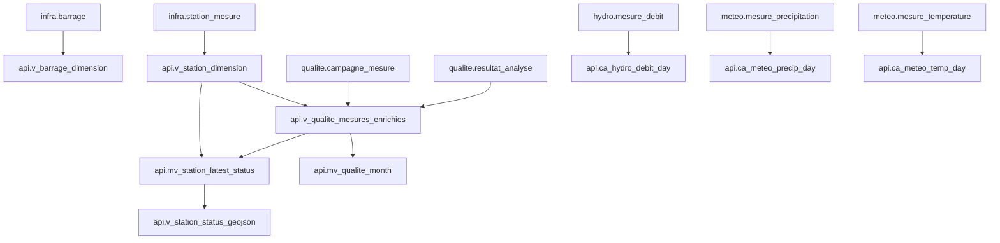

# 🔗 Matrice de Traçabilité API

## Dashboard → Endpoint → Vue → Table

| Dashboard | Composant UI | Endpoint(s) | Vue(s) SQL | Table(s) source | Volumétrie indicative |
|---|---|---|---|---|---|
| Climat | Graphique précipitations | `GET /api/v1/meteo/precipitations/timeseries` | `api.ca_meteo_precip_day` | `meteo.mesure_precipitation` | millions |
| Climat | Graphique températures | `GET /api/v1/meteo/temperatures/timeseries` | `api.ca_meteo_temp_day` | `meteo.mesure_temperature` | millions |
| Hydrologie | Courbe débit | `GET /api/v1/hydro/debits/timeseries` | `api.ca_hydro_debit_day` | `hydro.mesure_debit` | millions |
| Hydrologie | FDC | `GET /api/v1/hydro/debits/fdc` | calcul direct ou vue dédiée future | `hydro.mesure_debit` | millions |
| Qualité | Évolution N/O/P | `GET /api/v1/qualite/analyses/timeseries` | `api.mv_qualite_month`, `api.v_qualite_mesures_enrichies` | `qualite.campagne_mesure`, `qualite.resultat_analyse` | centaines de milliers |
| Principal carte | KPI stations | `GET /api/v1/map/overview` | `api.mv_station_latest_status` | multi-sources | faible |
| Principal carte | Couche stations qualité | `GET /api/v1/map/layers/quality-status` | `api.v_station_status_geojson` | `api.mv_station_latest_status` | faible |
| Données brutes | Table viewer | `GET /api/v1/raw/{schema}/{table}` | accès direct contrôlé | tables métier | variable |

## Filtres Dashboard → Paramètres API

| Filtre Dashboard | Type | Paramètre API | Validation | Valeurs possibles |
|---|---|---|---|---|
| Station | Dropdown | `station_id`, `station_ids[]` | UUID existant | `infra.station_mesure.id` |
| Période | Date range | `from`, `to` | ISO 8601, `to > from` | historique disponible |
| Agrégation | Select | `aggregate` | enum | `raw`, `day`, `month`, ... |
| Paramètre qualité | Multi-select | `param_codes[]` | code existant | `admin.catalogue_parametre.code` |
| Bassin | Dropdown | `bassin_id` | FK valide | `geo.bassin_versant.id` |
| Sous-bassin | Dropdown | `sous_bassin_id` | FK valide | `geo.sous_bassin.id` |
| BBox carte | Map extent | `bbox` | 4 nombres | emprise Maroc |

## Dépendances entre vues

