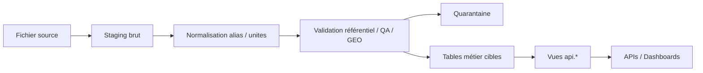

# Architecture cible ingestion

## Principes

- ingestion incrémentale par lot ;
- staging versionné ;
- mapping alias contrôlé ;
- validation référentiel avant exposition ;
- quarantaine sans blocage global ;
- audit et rollback par batch.

## Schéma logique cible

## Blocs cibles

| Bloc | Rôle |
|---|---|
| staging brut | stockage source immuable |
| staging normalisé | mapping colonnes / types |
| validation référentiel | résolution alias / paramètres |
| validation QA | types, valeurs, unités |
| validation GEO | XY, rattachement, support |
| quarantaine | lignes invalides ou ambiguës |
| audit | journal batch + décisions |
| rollback | annulation batch ciblé |

## Statuts à préserver

- `CONSULTATION_ONLY`
- `DOUBLE_CLASSIFICATION`
- `LEGACY_MODELING_TO_REPLACE`
- `FM`
- `F_M_MES`
- `MD`
