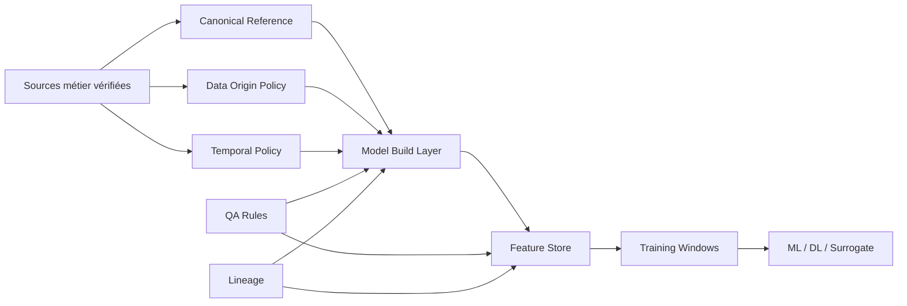

# Data Governance Foundation

| Champ | Valeur |
|---|---|
| Statut | PREPARATION_ONLY |
| Type | specification |
| Périmètre | fondation gouvernance pour Model Build, Feature Store et IA |
| Source de vérité | Non |
| Documents liés | `00_index.md`, `02_canonical_reference_spec.md`, `03_temporal_policy.md`, `04_data_origin_policy.md`, `05_feature_registry_spec.md` |
| Dernière mise à jour | 2026-05-20 |

## Contexte

| Statut | Constat |
|---|---|
| VERIFIED | Les schémas `model_build` et `feature_store` n'existent pas. |
| VERIFIED | Les schémas métier existants fournissent déjà météo, hydro, qualité, géographie, SWAT/WASP legacy et référentiels. |
| VERIFIED | La gouvernance analytique manque : pas de `feature_registry`, pas de `data_lineage` standard, pas de `temporal_policy`, pas de `data_origin_policy`. |
| VERIFIED | Les outputs SWAT/WASP actuels sont documentés comme `LEGACY_MODELING_TO_REPLACE`. |
| TO_VALIDATE | Les mappings spatiaux définitifs dépendent de la validation SIG/QA. |
| TO_VALIDATE | Les conventions SWAT+ dépendent du retour Reda. |
| TO_VALIDATE | Les conventions WASP dépendent du retour Anas. |

## Objectif

Préparer une couche de gouvernance qui permet de construire ensuite :

- un `model_build` traçable ;
- un `feature_store` anti-leakage ;
- des jeux ML reproductibles ;
- des validations QA automatiques ;
- une industrialisation auditable.

## Architecture cible conceptuelle



## Tables candidates de gouvernance

Ces tables sont des propositions non appliquées.

| Table candidate | Rôle | Statut | Dépendances |
|---|---|---|---|
| `metadata.canonical_entity_registry` | registre des entités analytiques canoniques : station, barrage, sous-bassin, reach, segment, site pollution | TO_VALIDATE | validation spatiale |
| `metadata.canonical_parameter_registry` | extension analytique autour du référentiel canonique existant | ASSUMPTION | arbitrage métier paramètres |
| `metadata.temporal_policy` | règles de temps par domaine/source | TO_VALIDATE | QA + métier |
| `metadata.data_origin_policy` | valeurs autorisées pour observed/modeled/interpolated/etc. | TO_VALIDATE | gouvernance data |
| `metadata.dataset_contract_registry` | contrat des datasets analytiques et ML : colonnes, unités, clés, QA, granularité | TO_VALIDATE | QA + ML + Reda + Anas |
| `metadata.unit_policy` | unités canoniques, conversions, plages physiques, précision | TO_VALIDATE | QA + métier |
| `metadata.validation_authority_registry` | autorité de validation par domaine, scope et niveau | TO_VALIDATE | gouvernance projet |
| `metadata.qa_rule_registry` | registre versionné des règles QA | TO_VALIDATE | QA |
| `metadata.lineage_run` | run de pipeline ou build dataset | TO_VALIDATE | industrialisation |
| `metadata.lineage_artifact` | artefact produit : table, vue, dataset, modèle, fichier | TO_VALIDATE | industrialisation |
| `feature_store.feature_registry` | registre des features calculées | TO_VALIDATE | Phase C |

## Champs standards transverses

| Champ | Type conceptuel | Usage |
|---|---|---|
| `run_id` | uuid | rattacher une production à un run reproductible |
| `source_system` | text | système source : ABH, NASA, SWAT, WASP, IDP, manual |
| `source_schema` | text | schéma source |
| `source_table` | text | table source |
| `source_row_id` | text | identifiant source si stable |
| `source_row_hash` | text | hash de ligne source |
| `business_key_hash` | text | hash de clé métier cible |
| `data_origin` | text | observed/modeled/interpolated/corrected/imported/expert_estimated |
| `qa_status` | text | validité analytique |
| `qa_flags` | jsonb | anomalies détaillées |
| `confidence_score` | numeric | confiance 0..1 |
| `lineage_id` | uuid | lien vers le lineage |
| `valid_from` | timestamptz | début validité métier |
| `valid_to` | timestamptz | fin validité métier |
| `version_code` | text | version métier ou modèle |
| `dataset_contract_code` | text | contrat de dataset applicable |
| `validation_domain` | text | domaine d'autorité : HYDRO, WASP, SWAT, SIG, QA, QUALITE |
| `validation_authority` | text | personne/rôle autorisé à valider |
| `validation_level` | text | TECHNICAL, SCIENTIFIC, BUSINESS, OFFICIAL |
| `created_at` | timestamptz | audit technique |

## Contraintes conceptuelles

| Règle | Statut |
|---|---|
| `confidence_score` entre 0 et 1 | ASSUMPTION |
| `qa_status` dans une nomenclature fermée | TO_VALIDATE |
| `data_origin` obligatoire dans Model Build et Feature Store | TO_VALIDATE |
| tout dataset ML doit avoir un `training_window_id` | ASSUMPTION |
| toute feature doit déclarer `as_of_date` et horizon cible | ASSUMPTION |
| aucun mapping spatial ambigu ne peut être marqué `VALIDATED` sans décision QA/SIG | VERIFIED |

## Nomenclature initiale proposée

| Famille | Valeurs proposées | Statut |
|---|---|---|
| `qa_status` | `VALIDATED`, `TO_VALIDATE`, `WARNING`, `REJECTED`, `LEGACY`, `NOT_APPLICABLE` | TO_VALIDATE |
| `geometry_status` | `VALIDATED`, `TO_VALIDATE`, `MISSING`, `INVALID`, `OUTSIDE_BASIN`, `CONFLICT`, `ORPHAN` | dépend validation spatiale |
| `temporal_status` | `COMPLETE`, `GAPPED`, `SHORT_SERIES`, `IRREGULAR`, `FUTURE_DATE`, `UNKNOWN` | TO_VALIDATE |
| `model_status` | `LEGACY`, `CANDIDATE`, `VALIDATED_BY_REDA`, `VALIDATED_BY_ANAS`, `REJECTED` | dépend Reda / Anas |

## Dataset contracts

| Statut | Principe |
|---|---|
| TO_VALIDATE | Aucun dataset Model Build, Feature Store ou ML ne doit être considéré officiel sans contrat de dataset. |
| ASSUMPTION | Le contrat doit être versionné et référencé par `dataset_contract_code`. |
| ASSUMPTION | Un contrat peut être `DRAFT`, `QA_READY`, `ACTIVE`, `DEPRECATED` ou `BLOCKED`. |

Table candidate non appliquée :

```sql
-- NON EXECUTE - SPECIFICATION ONLY
CREATE TABLE metadata.dataset_contract_registry (
    dataset_contract_id uuid PRIMARY KEY,
    dataset_contract_code text NOT NULL UNIQUE,
    dataset_name text NOT NULL,
    dataset_family text NOT NULL,
    target_layer text NOT NULL,
    entity_grain text NOT NULL,
    temporal_grain text NOT NULL,
    required_columns jsonb NOT NULL,
    required_keys text[] NOT NULL,
    required_units jsonb NOT NULL,
    forbidden_values jsonb NOT NULL DEFAULT '{}'::jsonb,
    physical_ranges jsonb NOT NULL DEFAULT '{}'::jsonb,
    qa_rule_codes text[] NOT NULL,
    temporal_policy_code text NOT NULL,
    data_origin_allowed text[] NOT NULL,
    validation_domain text NOT NULL,
    validation_authority text,
    status text NOT NULL,
    version_code text NOT NULL,
    created_at timestamptz NOT NULL DEFAULT now()
);
```

Exemples de contenu attendu :

| Champ contractuel | Exemple |
|---|---|
| colonnes obligatoires | `canonical_entity_id`, `as_of_date`, `qa_status`, `lineage_id` |
| unités attendues | `m3/s`, `mm`, `mg/L` |
| granularité | `daily`, `campaign`, `event` |
| valeurs interdites | `NaN`, `Infinity`, dates futures non justifiées |
| plages physiques | débit >= 0 sauf exception QA documentée |

## Unit policy

Table candidate non appliquée :

```sql
-- NON EXECUTE - SPECIFICATION ONLY
CREATE TABLE metadata.unit_policy (
    unit_policy_id uuid PRIMARY KEY,
    unit_policy_code text NOT NULL UNIQUE,
    family text NOT NULL,
    parameter_code text,
    source_unit text NOT NULL,
    canonical_unit text NOT NULL,
    conversion_rule text NOT NULL,
    conversion_factor numeric,
    allowed_min numeric,
    allowed_max numeric,
    precision_digits integer,
    qa_status text NOT NULL,
    validation_status text NOT NULL,
    created_at timestamptz NOT NULL DEFAULT now()
);
```

| Statut | Règle |
|---|---|
| VERIFIED | Les unités WASP sont incomplètes dans les variables auditées. |
| VERIFIED | Les unités réglementaires qualité nécessitent des conversions, par exemple métaux `µg/l` vers `mg/L`. |
| TO_VALIDATE | Les plages physiques par paramètre doivent être validées par domaine métier. |
| TO_VALIDATE | Les conversions SWAT/WASP doivent être validées par Reda et Anas. |

## Validation authority

Table candidate non appliquée :

```sql
-- NON EXECUTE - SPECIFICATION ONLY
CREATE TABLE metadata.validation_authority_registry (
    validation_authority_id uuid PRIMARY KEY,
    validation_domain text NOT NULL,
    validation_scope text NOT NULL,
    validation_authority text NOT NULL,
    validation_level text NOT NULL,
    can_validate_statuses text[] NOT NULL,
    escalation_authority text,
    active boolean NOT NULL DEFAULT true,
    metadata_json jsonb NOT NULL DEFAULT '{}'::jsonb,
    created_at timestamptz NOT NULL DEFAULT now(),
    UNIQUE (validation_domain, validation_scope, validation_level)
);
```

| Domaine | Autorité candidate | Niveau | Statut |
|---|---|---|---|
| SWAT | Reda | SCIENTIFIC | TO_VALIDATE |
| WASP | Anas | SCIENTIFIC | TO_VALIDATE |
| SIG / spatial | collaboratrice SIG/QA | TECHNICAL | TO_VALIDATE |
| qualité eau | métier qualité / ABH | BUSINESS | TO_VALIDATE |
| gouvernance dataset | QA/Data lead | TECHNICAL | TO_VALIDATE |
| décision officielle | DG / ABH | OFFICIAL | TO_VALIDATE |

## Risques

| Risque | Impact | Mitigation |
|---|---|---|
| figer trop tôt les mappings spatiaux | erreurs irréversibles dans Model Build | garder `TO_VALIDATE` jusqu'au retour SIG/QA |
| mélanger outputs legacy et runs validés | datasets ML contaminés | imposer `model_status` et `data_origin` |
| absence de politique temporelle | data leakage | imposer `as_of_date`, `target_date`, `forecast_horizon` |
| nomenclature QA trop large | faible automatisation | registre QA versionné |
| absence de dataset contract | datasets non reproductibles et non testables | imposer `dataset_contract_code` |
| unités non gouvernées | erreurs scientifiques silencieuses | imposer `unit_policy` |
| autorité de validation implicite | blocages organisationnels | registre d'autorité par domaine |

## Décision attendue

Valider le principe de gouvernance suivant avant Phase B :

> aucune table `model_build` ou `feature_store` ne doit être considérée production-ready sans `data_origin`, `qa_status`, `lineage_id`, politique temporelle et statut spatial explicite.
