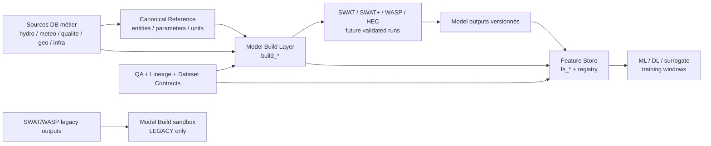

# Model Build Specification

| Champ | Valeur |
|---|---|
| Statut | PREPARATION_ONLY |
| Type | specification / design |
| Périmètre | couche `model_build` future pour SWAT/SWAT+/WASP/HEC, Feature Store et ML |
| Source de vérité | Non - préparation avant validations Reda, Anas et SIG/QA |
| Documents liés | `01_data_governance_foundation.md`, `02_canonical_reference_spec.md`, `03_temporal_policy.md`, `04_data_origin_policy.md`, `05_feature_registry_spec.md`, `docs/88_swat_wasp_legacy_transition/` |
| Dernière mise à jour | 2026-05-20 |

## 1. Objectif du Model Build Layer

Le schéma cible `model_build` prépare une couche analytique intermédiaire entre les sources métier et les couches de modélisation/IA.

| Statut | Principe |
|---|---|
| VERIFIED | Les schémas `model_build` et `feature_store` n'existent pas encore. |
| VERIFIED | Les outputs SWAT/WASP actuels sont `LEGACY_MODELING_TO_REPLACE`. |
| TO_VALIDATE | Les mappings spatiaux définitifs dépendent de la validation SIG/QA. |
| TO_VALIDATE | Les mappings et conventions SWAT+ dépendent de Reda. |
| TO_VALIDATE | Les mappings et conventions WASP dépendent d'Anas. |

Le Model Build Layer ne remplace pas les sources. Il prépare des objets propres, versionnés, traçables et auditables pour :

- assembler les inputs SWAT/SWAT+/WASP/HEC ;
- isoler les outputs legacy des futurs runs validés ;
- préparer les jeux d'observations calibrables ;
- exposer des séries homogènes vers Feature Store ;
- conserver lineage, QA, temporal policy, units et dataset contracts.

## 2. Séparation des couches

| Couche | Rôle | Exemple | Usage |
|---|---|---|---|
| raw / staging | données importées brutes ou préservées | `staging.raw_*` | audit source, rollback |
| processed / métier | tables métier exploitables | `hydro.*`, `meteo.*`, `qualite.*`, `geo.*`, `infra.*` | dashboards, API, contrôles |
| canonical reference | entités, paramètres et unités stabilisés | `metadata.*`, registres candidats | clés communes |
| model_build | couche de préparation modèles | `model_build.build_*` | SWAT/WASP/HEC, calibration |
| feature_store | features ML versionnées | `feature_store.fs_*` | ML, scoring, monitoring |
| datasets IA | fenêtres entraînement/test | training windows | modèles ML/DL/surrogate |

Différences critiques :

| Objet | Définition |
|---|---|
| données brutes | lignes source non interprétées, jamais vérité analytique directe |
| données observées | mesures terrain/station/labo avec `data_origin=observed` |
| données corrigées | valeurs modifiées par QA/métier avec décision traçable |
| données calibrées | outputs/paramètres après calibration scientifique validée |
| outputs modèles | résultats SWAT/WASP/HEC, toujours séparés des observations |
| scénarios | configurations versionnées d'hypothèses et paramètres |
| datasets IA | assemblages verrouillés par contrat, temporal policy et anti-leakage |

## 3. Architecture conceptuelle



## 4. Champs standards obligatoires

Toutes les tables temporelles `model_build` doivent intégrer conceptuellement :

```sql
-- NON EXECUTE - SPECIFICATION ONLY
canonical_entity_id uuid,
entity_type text,
event_time timestamptz,
bucket_day date,
as_of_date date,
target_date date,
forecast_horizon_days integer,
data_origin text,
source_model text,
source_model_version text,
scenario_code text,
run_id uuid,
lineage_id uuid,
qa_status text,
qa_flags jsonb,
confidence_score numeric,
geometry_status text,
temporal_policy_code text,
dataset_contract_code text,
unit_policy_code text,
freshness_days integer,
freshness_class text,
validation_domain text,
validation_authority text,
version_code text,
created_at timestamptz
```

Pour les tables non temporelles, le noyau minimal reste :

```sql
-- NON EXECUTE - SPECIFICATION ONLY
canonical_entity_id uuid,
entity_type text,
data_origin text,
lineage_id uuid,
qa_status text,
qa_flags jsonb,
confidence_score numeric,
geometry_status text,
dataset_contract_code text,
validation_domain text,
validation_authority text,
version_code text,
created_at timestamptz
```

## 5. Model Build status system

| Statut | Définition | Promotion possible par | Conditions |
|---|---|---|---|
| `DRAFT` | spécification ou objet préparatoire | Data governance | structure documentée |
| `LEGACY` | données historiques non finales | Data governance | traçabilité + interdiction official |
| `SANDBOX` | utilisable pour test non officiel | QA/Data | dataset contract sandbox |
| `QA_READY` | contrôles QA définis | QA | règles QA + lineage |
| `VALIDATED` | validé techniquement/métier | SIG/QA, Reda, Anas selon scope | QA passée |
| `SCIENTIFICALLY_APPROVED` | validé scientifiquement modèle | Reda ou Anas | calibration/mapping approuvés |
| `OFFICIAL` | version officielle projet/client | DG / ABH | validation scientifique + business |
| `BLOCKED` | dépendance non résolue | Data governance | motif documenté |
| `DEPRECATED` | conservé mais remplacé | Data governance | remplacement identifié |

Règles :

- aucun objet spatial ne peut dépasser `QA_READY` sans validation SIG/QA ;
- aucun output SWAT ne peut dépasser `SANDBOX` sans Reda ;
- aucun output WASP ne peut dépasser `SANDBOX` sans Anas ;
- aucun output legacy ne peut être `OFFICIAL` ;
- aucun dataset ne peut être `VALIDATED` sans `dataset_contract_code`, `temporal_policy_code`, `lineage_id` et `qa_status`.

## 6. DDL conceptuel non appliqué

### 6.1 Schéma

```sql
-- NON EXECUTE - SPECIFICATION ONLY
CREATE SCHEMA IF NOT EXISTS model_build;
```

### 6.2 Entités spatiales de build

```sql
-- NON EXECUTE - SPECIFICATION ONLY
CREATE TABLE model_build.build_catchments (
    catchment_build_id uuid PRIMARY KEY,
    canonical_entity_id uuid,
    catchment_code text NOT NULL,
    catchment_name text,
    catchment_type text NOT NULL,
    source_schema text,
    source_table text,
    source_pk text,
    geom geometry,
    area_km2 numeric,
    parent_catchment_id uuid,
    geometry_status text NOT NULL,
    topology_status text,
    data_origin text NOT NULL,
    lineage_id uuid,
    qa_status text NOT NULL,
    qa_flags jsonb NOT NULL DEFAULT '{}'::jsonb,
    confidence_score numeric,
    dataset_contract_code text,
    validation_domain text,
    validation_authority text,
    version_code text NOT NULL,
    build_status text NOT NULL,
    created_at timestamptz NOT NULL DEFAULT now()
);

CREATE TABLE model_build.build_reaches (
    reach_build_id uuid PRIMARY KEY,
    canonical_entity_id uuid,
    reach_code text NOT NULL,
    source_schema text,
    source_table text,
    source_pk text,
    swat_rch_number integer,
    wasp_segment_id integer,
    upstream_reach_id uuid,
    downstream_reach_id uuid,
    catchment_build_id uuid,
    geom geometry,
    length_m numeric,
    slope numeric,
    hydraulic_direction_validated boolean NOT NULL DEFAULT false,
    topology_confidence numeric,
    geometry_status text NOT NULL,
    edge_quality text,
    node_quality text,
    data_origin text NOT NULL,
    lineage_id uuid,
    qa_status text NOT NULL,
    qa_flags jsonb NOT NULL DEFAULT '{}'::jsonb,
    confidence_score numeric,
    dataset_contract_code text,
    validation_domain text,
    validation_authority text,
    version_code text NOT NULL,
    build_status text NOT NULL,
    created_at timestamptz NOT NULL DEFAULT now()
);

CREATE TABLE model_build.build_hrus (
    hru_build_id uuid PRIMARY KEY,
    canonical_entity_id uuid,
    hru_code text NOT NULL,
    catchment_build_id uuid,
    swat_subbasin_code text,
    landuse_code text,
    soil_code text,
    slope_class text,
    area_km2 numeric,
    geom geometry,
    geometry_status text NOT NULL,
    data_origin text NOT NULL,
    lineage_id uuid,
    qa_status text NOT NULL,
    qa_flags jsonb NOT NULL DEFAULT '{}'::jsonb,
    confidence_score numeric,
    dataset_contract_code text,
    validation_domain text,
    validation_authority text,
    version_code text NOT NULL,
    build_status text NOT NULL,
    created_at timestamptz NOT NULL DEFAULT now()
);
```

### 6.3 Séries temporelles

```sql
-- NON EXECUTE - SPECIFICATION ONLY
CREATE TABLE model_build.build_hydro_series (
    hydro_series_id uuid PRIMARY KEY,
    canonical_entity_id uuid NOT NULL,
    entity_type text NOT NULL,
    variable_code text NOT NULL,
    event_time timestamptz NOT NULL,
    bucket_day date NOT NULL,
    as_of_date date NOT NULL,
    target_date date,
    forecast_horizon_days integer,
    value_num numeric,
    unit_policy_code text,
    data_origin text NOT NULL,
    source_model text,
    source_model_version text,
    scenario_code text,
    run_id uuid,
    lineage_id uuid,
    qa_status text NOT NULL,
    qa_flags jsonb NOT NULL DEFAULT '{}'::jsonb,
    confidence_score numeric,
    geometry_status text,
    temporal_policy_code text NOT NULL,
    dataset_contract_code text NOT NULL,
    freshness_days integer,
    freshness_class text,
    validation_domain text,
    validation_authority text,
    version_code text NOT NULL,
    build_status text NOT NULL,
    created_at timestamptz NOT NULL DEFAULT now()
);

CREATE TABLE model_build.build_meteo_series (LIKE model_build.build_hydro_series INCLUDING ALL);
CREATE TABLE model_build.build_quality_series (LIKE model_build.build_hydro_series INCLUDING ALL);
CREATE TABLE model_build.build_pollution_series (LIKE model_build.build_hydro_series INCLUDING ALL);
CREATE TABLE model_build.build_boundary_conditions (LIKE model_build.build_hydro_series INCLUDING ALL);
CREATE TABLE model_build.build_observed_series (LIKE model_build.build_hydro_series INCLUDING ALL);
```

### 6.4 Paramètres et scénarios

```sql
-- NON EXECUTE - SPECIFICATION ONLY
CREATE TABLE model_build.build_parameters (
    build_parameter_id uuid PRIMARY KEY,
    parameter_code text NOT NULL,
    parameter_name text,
    parameter_domain text NOT NULL,
    model_family text,
    unit_policy_code text,
    physical_min numeric,
    physical_max numeric,
    sensitivity_class text,
    is_calibrable boolean NOT NULL DEFAULT false,
    source_schema text,
    source_table text,
    source_pk text,
    data_origin text NOT NULL,
    lineage_id uuid,
    qa_status text NOT NULL,
    qa_flags jsonb NOT NULL DEFAULT '{}'::jsonb,
    confidence_score numeric,
    validation_domain text,
    validation_authority text,
    version_code text NOT NULL,
    build_status text NOT NULL,
    created_at timestamptz NOT NULL DEFAULT now(),
    UNIQUE (parameter_code, model_family, version_code)
);

CREATE TABLE model_build.build_parameter_sets (
    parameter_set_id uuid PRIMARY KEY,
    parameter_set_code text NOT NULL UNIQUE,
    model_family text NOT NULL,
    scenario_code text,
    parent_parameter_set_id uuid,
    calibration_status text NOT NULL,
    parameters_json jsonb NOT NULL,
    freeze_window_start date,
    freeze_window_end date,
    lineage_id uuid,
    qa_status text NOT NULL,
    validation_domain text,
    validation_authority text,
    version_code text NOT NULL,
    build_status text NOT NULL,
    created_at timestamptz NOT NULL DEFAULT now()
);

CREATE TABLE model_build.build_scenarios (
    scenario_id uuid PRIMARY KEY,
    scenario_code text NOT NULL UNIQUE,
    scenario_family text NOT NULL,
    scenario_name text NOT NULL,
    parent_scenario_id uuid,
    climate_scenario text,
    pollution_scenario text,
    calibration_scenario text,
    operational_scenario text,
    exploratory_scenario text,
    scenario_status text NOT NULL,
    freeze_window_start date,
    freeze_window_end date,
    lineage_id uuid,
    qa_status text NOT NULL,
    validation_domain text,
    validation_authority text,
    version_code text NOT NULL,
    build_status text NOT NULL,
    created_at timestamptz NOT NULL DEFAULT now()
);

CREATE TABLE model_build.build_scenario_versions (
    scenario_version_id uuid PRIMARY KEY,
    scenario_id uuid NOT NULL,
    scenario_code text NOT NULL,
    version_code text NOT NULL,
    parent_version_code text,
    change_reason text,
    input_hash text,
    parameter_set_id uuid,
    frozen boolean NOT NULL DEFAULT false,
    validation_status text NOT NULL,
    lineage_id uuid,
    created_at timestamptz NOT NULL DEFAULT now(),
    UNIQUE (scenario_code, version_code)
);
```

### 6.5 Runs, artefacts, QA et lineage

```sql
-- NON EXECUTE - SPECIFICATION ONLY
CREATE TABLE model_build.build_model_runs (
    run_id uuid PRIMARY KEY,
    run_code text NOT NULL UNIQUE,
    model_family text NOT NULL,
    model_version text,
    scenario_code text NOT NULL,
    scenario_version_id uuid,
    parameter_set_id uuid,
    run_status text NOT NULL,
    started_at timestamptz,
    completed_at timestamptz,
    input_dataset_contract_code text,
    output_dataset_contract_code text,
    reproducibility_hash text,
    lineage_id uuid,
    qa_status text NOT NULL,
    validation_domain text,
    validation_authority text,
    build_status text NOT NULL,
    created_at timestamptz NOT NULL DEFAULT now()
);

CREATE TABLE model_build.build_run_artifacts (
    artifact_id uuid PRIMARY KEY,
    run_id uuid NOT NULL,
    artifact_type text NOT NULL,
    artifact_uri text,
    source_file text,
    file_hash text,
    row_count bigint,
    qa_status text NOT NULL,
    lineage_id uuid,
    created_at timestamptz NOT NULL DEFAULT now()
);

CREATE TABLE model_build.build_geometry_status (
    geometry_status_id uuid PRIMARY KEY,
    canonical_entity_id uuid,
    entity_type text NOT NULL,
    source_schema text,
    source_table text,
    source_pk text,
    geometry_status text NOT NULL,
    srid integer,
    is_valid boolean,
    outside_basin boolean,
    orphan_status text,
    conflict_status text,
    topology_confidence numeric,
    validation_domain text,
    validation_authority text,
    validated_at timestamptz,
    qa_flags jsonb NOT NULL DEFAULT '{}'::jsonb,
    lineage_id uuid,
    created_at timestamptz NOT NULL DEFAULT now()
);

CREATE TABLE model_build.build_quality_flags (
    quality_flag_id uuid PRIMARY KEY,
    target_schema text NOT NULL,
    target_table text NOT NULL,
    target_pk text NOT NULL,
    flag_code text NOT NULL,
    flag_severity text NOT NULL,
    flag_domain text NOT NULL,
    flag_message text,
    blocking boolean NOT NULL DEFAULT false,
    detected_at timestamptz NOT NULL DEFAULT now(),
    resolved_at timestamptz,
    resolution_status text NOT NULL DEFAULT 'OPEN',
    validation_domain text,
    validation_authority text,
    lineage_id uuid
);

CREATE TABLE model_build.build_lineage (
    lineage_id uuid PRIMARY KEY,
    lineage_code text NOT NULL UNIQUE,
    parent_lineage_id uuid,
    source_schema text,
    source_table text,
    source_pk text,
    source_file text,
    source_hash text,
    transformation_name text,
    transformation_version text,
    run_id uuid,
    dataset_contract_code text,
    temporal_policy_code text,
    data_origin text,
    created_by text,
    created_at timestamptz NOT NULL DEFAULT now()
);
```

## 7. Table-by-table specification

| Table | Objectif | Grain | Sources candidates | Dépendances | Usage |
|---|---|---|---|---|---|
| `build_catchments` | bassins/sous-bassins canoniques pour modèles | 1 entité bassin/sous-bassin/version | `geo.bassin_versant`, `geo.sous_bassin_abh`, `geo.sous_bassin_swat_*`, `swat_output.ref_subbasin` | Reda, SIG/QA | SWAT, Graph AI, Feature Store spatial |
| `build_reaches` | tronçons/reaches/segments orientables | 1 reach/version | `geo.reseau_hydrographique`, `geo_work.reseau_hydro_edges_final`, `wasp_output.ref_segment_modele` | Anas, SIG/QA | WASP, Graph AI |
| `build_hrus` | unités hydrologiques SWAT/SWAT+ | 1 HRU/version | non vérifié | Reda | SWAT+, ML spatial |
| `build_hydro_series` | séries débit/barrage prêtes modèle | entité-variable-jour-version | `hydro.mesure_debit`, `hydro.mesure_barrage_param` | QA hydro | SWAT/WASP boundary, ML |
| `build_meteo_series` | séries météo prêtes modèle | station-variable-jour-version | `meteo.mesure_precipitation`, `meteo.mesure_evaporation` | QA météo, unit policy | SWAT, ML |
| `build_quality_series` | séries qualité observées/sparse | entité-paramètre-date-version | `qualite.mesure_qualite_*`, `qualite.resultat_mesure` | QA qualité, freshness | WASP, ML sparse |
| `build_pollution_series` | apports/événements pollution | site/point-paramètre-date-version | `qualite.resultat_mesure`, IDP staging | Anas, SIG/QA | WASP, event ML |
| `build_boundary_conditions` | conditions limites modèles | boundary-variable-jour-scenario | hydro, qualité, météo, pollution | Reda/Anas | SWAT/WASP/HEC |
| `build_observed_series` | observations de calibration/validation | entité-variable-date-version | hydro/météo/qualité validées | Reda/Anas/QA | calibration, metrics |
| `build_parameters` | paramètres modèle et métier | paramètre-modèle-version | référentiels, modèle | Reda/Anas | calibration |
| `build_parameter_sets` | jeux de paramètres versionnés | set-modèle-scenario-version | paramètres | Reda/Anas | runs reproductibles |
| `build_scenarios` | gouvernance scénarios | scénario | métier, modèles | DG, Reda, Anas | simulation |
| `build_scenario_versions` | versions immuables scénario | scénario-version | scenario registry | gouvernance | reproductibilité |
| `build_model_runs` | journal runs modèles | run modèle | SWAT/WASP/HEC | Reda/Anas | audit, comparaison |
| `build_run_artifacts` | fichiers et artefacts de runs | artefact-run | outputs fichiers/tables | data governance | traçabilité |
| `build_geometry_status` | QA spatiale consolidée | entité-source-version | SIG/QA | validation spatiale | Graph AI, build |
| `build_quality_flags` | anomalies bloquantes/non bloquantes | flag-objet | QA rules | QA | filtrage |
| `build_lineage` | provenance complète | lineage node | toutes sources | industrialisation | audit |

## 8. Contract bindings

Les tables `model_build` ne doivent pas être peuplées ou promues sans contrat dataset explicite. Les codes ci-dessous sont des candidats non définitifs.

| Table | Dataset contract candidat | Statut | Conditions minimales |
|---|---|---|---|
| `build_catchments` | `CONTRACT_MODEL_BUILD_CATCHMENTS_V1` | TO_VALIDATE | géométrie valide, SRID documenté, source canonique, statut SIG/QA |
| `build_reaches` | `CONTRACT_MODEL_BUILD_REACHES_V1` | dépend validation spatiale | direction/topologie qualifiées, mapping reach/segment non ambigu |
| `build_hrus` | `CONTRACT_MODEL_BUILD_HRUS_V1` | dépend Reda | définition HRU SWAT+ validée, surface, sol, pente, occupation |
| `build_hydro_series` | `CONTRACT_MODEL_BUILD_HYDRO_DAILY_V1` | TO_VALIDATE | unité canonique, pas de leakage, QA débit/barrage |
| `build_meteo_series` | `CONTRACT_MODEL_BUILD_METEO_DAILY_V1` | TO_VALIDATE | fréquence daily, unité canonique, source et gaps documentés |
| `build_quality_series` | `CONTRACT_MODEL_BUILD_QUALITY_SPARSE_V1` | TO_VALIDATE | qualité sparse, freshness score, unité et QA paramètre |
| `build_pollution_series` | `CONTRACT_MODEL_BUILD_POLLUTION_EVENT_V1` | dépend SIG/QA + Anas | site validé, point/source non orphelin, paramètre mappé |
| `build_boundary_conditions` | `CONTRACT_MODEL_BUILD_BOUNDARY_CONDITIONS_V1` | dépend Reda / Anas | boundary type, modèle cible, unité, scénario |
| `build_observed_series` | `CONTRACT_MODEL_BUILD_OBSERVED_SERIES_V1` | TO_VALIDATE | `data_origin=observed/corrected`, QA et lineage complets |
| `build_parameters` | `CONTRACT_MODEL_BUILD_PARAMETERS_V1` | dépend Reda / Anas | unité, plage physique, calibrable, validateur |
| `build_parameter_sets` | `CONTRACT_MODEL_BUILD_PARAMETER_SETS_V1` | dépend Reda / Anas | version gelée, parentage, hash et scénario |
| `build_scenarios` | `CONTRACT_MODEL_BUILD_SCENARIOS_V1` | dépend DG | famille, statut, parent, freeze window |
| `build_scenario_versions` | `CONTRACT_MODEL_BUILD_SCENARIO_VERSIONS_V1` | dépend gouvernance | version immuable, hash inputs, lineage |
| `build_model_runs` | `CONTRACT_MODEL_BUILD_RUNS_V1` | dépend Reda / Anas | modèle, scénario, parameter set, reproducibility hash |
| `build_run_artifacts` | `CONTRACT_MODEL_BUILD_ARTIFACTS_V1` | TO_VALIDATE | URI/fichier, hash, row count, QA artifact |
| `build_geometry_status` | `CONTRACT_MODEL_BUILD_GEOMETRY_STATUS_V1` | dépend SIG/QA | SRID, validité, orphan/conflict status |
| `build_quality_flags` | `CONTRACT_MODEL_BUILD_QA_FLAGS_V1` | dépend QA | flag code, severity, blocking scope, resolution |
| `build_lineage` | `CONTRACT_MODEL_BUILD_LINEAGE_V1` | TO_VALIDATE | source, transformation, run, hash, parent lineage |

Règles de binding :

- `dataset_contract_code` est obligatoire dans toutes les tables de build.
- un contrat `DRAFT` autorise uniquement `DRAFT` ou `SANDBOX`;
- un contrat `BLOCKED` bloque toute promotion au-delà de `DRAFT`;
- un contrat `QA_READY` autorise `QA_READY`, mais pas `VALIDATED`;
- un contrat `ACTIVE` est requis pour `VALIDATED`, `SCIENTIFICALLY_APPROVED` et `OFFICIAL`;
- les contrats SWAT restent bloqués au-delà de `SANDBOX` sans Reda;
- les contrats WASP restent bloqués au-delà de `SANDBOX` sans Anas;
- les contrats spatiaux restent bloqués au-delà de `QA_READY` sans validation SIG/QA.

Exemple de contrainte conceptuelle non appliquée :

```sql
-- NON EXECUTE - SPECIFICATION ONLY
-- Future rule: model_build rows with build_status in
-- ('VALIDATED', 'SCIENTIFICALLY_APPROVED', 'OFFICIAL')
-- must reference an ACTIVE dataset contract.
```

## 9. Scenario governance

Familles proposées :

| Famille | Rôle | Statut |
|---|---|---|
| `climate_scenario` | climat, météo, projections | TO_VALIDATE |
| `pollution_scenario` | charges ponctuelles/diffuses | TO_VALIDATE |
| `calibration_scenario` | calibration paramètres | dépend Reda / Anas |
| `operational_scenario` | scénario décisionnel validé | dépend DG |
| `exploratory_scenario` | hypothèse sandbox | ASSUMPTION |

Règles :

- un scénario officiel doit être gelé (`frozen=true`) ;
- toute version doit avoir `input_hash` et `parameter_set_id` ;
- un scénario enfant doit référencer son parent ;
- aucune comparaison de scénarios ne doit mélanger versions non gelées et officielles ;
- les scénarios legacy restent séparés des scénarios validés.

## 10. Parameter governance

Chaque paramètre de build doit documenter :

| Attribut | Usage |
|---|---|
| unité canonique | éviter les conversions silencieuses |
| plage physique | QA et impossibilités |
| domaine | hydro, meteo, qualité, pollution, modèle |
| validateur | Reda, Anas, QA, métier |
| modèle concerné | SWAT/SWAT+/WASP/HEC/observed |
| sensibilité | priorité calibration |
| calibrable | oui/non |
| source | table, fichier, hypothèse |
| statut | DRAFT, LEGACY, VALIDATED, etc. |

Règle critique : un paramètre calibrable ne peut pas être `OFFICIAL` sans autorité scientifique explicite.

## 11. QA-first design

| Axe QA | Champs / table | Règle |
|---|---|---|
| géométrie | `build_geometry_status`, `geometry_status` | aucun spatial actif sans SIG/QA |
| valeurs | `build_quality_flags`, `qa_flags` | valeurs impossibles bloquantes |
| temporalité | `temporal_policy_code`, `as_of_date` | anti-leakage obligatoire |
| complétude | `completeness_score` conceptuel | seuil par contrat dataset |
| incertitude | `uncertainty_class` conceptuel | propagation future |
| lineage | `build_lineage` | aucune donnée officielle sans provenance |
| unités | `unit_policy_code` | conversion traçable |

Règles bloquantes :

- aucun dataset `VALIDATED` sans QA ;
- aucun spatial `ACTIVE` sans validation SIG ;
- aucun output modèle `OFFICIAL` sans validation Reda/Anas ;
- aucune série sparse qualité sans freshness score ;
- aucune feature future sans dataset contract.

## 12. Legacy vs future validated

| Catégorie | Description | Autorisé Feature Store | Autorisé ML target | Statut |
|---|---|---|---|---|
| legacy outputs | SWAT/WASP actuels | sandbox uniquement | non | `LEGACY_MODELING_TO_REPLACE` |
| sandbox | tests internes | oui sandbox | non | `SANDBOX` |
| candidate runs | nouveaux runs non validés | oui expérimental | non | `DRAFT/QA_READY` |
| validated runs | validés Reda/Anas | oui | selon usage | `VALIDATED` |
| official runs | validés scientifiquement + DG/ABH | oui | oui si contrat | `OFFICIAL` |

Les données `swat_output.*`, `wasp_output.*` et `wasp_sebou.*` peuvent préparer les contrats et les tests, mais ne doivent pas être promues comme vérité finale.

## 13. Préparation Graph AI

Concepts à préparer, sans créer de Graph AI :

| Concept | Source candidate | Statut |
|---|---|---|
| reach graph | `build_reaches` | dépend validation spatiale |
| upstream/downstream | `upstream_reach_id`, `downstream_reach_id` | TO_VALIDATE |
| topology confidence | `topology_confidence` | TO_VALIDATE |
| graph entity ids | `canonical_entity_id`, `reach_build_id` | ASSUMPTION |
| edge quality | `edge_quality` | dépend SIG/QA |
| node quality | `node_quality` | dépend SIG/QA |
| propagation readiness | QA topology + direction | TO_VALIDATE |

Règle : `geo_work.reseau_hydro_edges_final` reste un runtime topologique visuel tant que la direction hydraulique n'est pas validée.

## 14. Risques

| Risque | Impact | Mitigation |
|---|---|---|
| conflits spatiaux non résolus | mauvais rattachement station/reach/site | bloquer `VALIDATED` |
| entités orphelines | pertes de données ou faux liens | `geometry_status=ORPHAN` |
| temporal leakage | métriques ML fausses | `as_of_date` obligatoire |
| contamination legacy | modèles entraînés sur outputs non officiels | `LEGACY` et sandbox |
| incohérences unités | erreurs scientifiques silencieuses | `unit_policy_code` |
| divergence scénarios | runs non comparables | scenario versions gelées |
| mappings non résolus | SWAT/WASP instables | dépendances Reda/Anas |
| observed/modeled mélangés | calibration et ML invalides | `data_origin` obligatoire |

## 15. Decisions to validate

### TO_VALIDATE_WITH_REDA

- mapping SWAT+ sous-bassins / reaches / HRUs ;
- variables SWAT+ officielles ;
- unités et plages physiques ;
- jeux de paramètres calibrables ;
- fenêtres calibration/validation ;
- statut des outputs legacy SWAT ;
- critères `SCIENTIFICALLY_APPROVED`.

### TO_VALIDATE_WITH_ANAS

- mapping WASP segments ↔ réseau hydrographique ;
- variables WASP officielles et unités ;
- boundary conditions ;
- statut des outputs legacy WASP ;
- règles surrogate contrôlé ;
- critères `SCIENTIFICALLY_APPROVED`.

### TO_VALIDATE_WITH_SIG_QA

- validation géométrique stations/sites/reaches ;
- orphelins et conflits spatiaux ;
- doublons points/prélèvements IDP ;
- mapping points ↔ réseau hydrographique ;
- direction hydraulique et topology confidence.

### TO_VALIDATE_WITH_DG

- statut `OFFICIAL` ;
- scénarios opérationnels ;
- règles de publication ;
- arbitrage final des jeux utilisés pour décision.

### TO_VALIDATE_WITH_DATA_GOVERNANCE

- nomenclature finale `build_status` ;
- dataset contracts ;
- unit policy ;
- validation authority ;
- lineage minimal obligatoire ;
- règles de promotion entre statuts.
