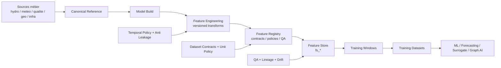

# Feature Store Specification

| Champ | Valeur |
|---|---|
| Statut | PREPARATION_ONLY |
| Type | specification / design |
| Périmètre | couche `feature_store` future pour ML, forecasting, surrogate, monitoring et Graph AI |
| Source de vérité | Non - préparation avant validations métier, modèle et SIG/QA |
| Documents liés | `01_data_governance_foundation.md`, `03_temporal_policy.md`, `05_feature_registry_spec.md`, `06_model_build_specification.md` |
| Dernière mise à jour | 2026-05-20 |

## 1. Objectif du Feature Store

Le Feature Store est la couche gouvernée des variables calculées. Il ne remplace pas `model_build`.

| Couche | Rôle | Ce qu'elle ne doit pas faire |
|---|---|---|
| `model_build` | assembler données prêtes modèles, scénarios, paramètres, observations et runs | entraîner directement des modèles ML |
| `feature_store` | produire des features versionnées, QA, anti-leakage et réutilisables | recalculer librement sans registry |
| datasets IA | figer des fenêtres d'entraînement/test pour un objectif ML précis | modifier les features ou leurs règles |

Le Feature Store existe pour :

- empêcher les features non documentées ;
- garantir lineage et reproductibilité ;
- appliquer `as_of_date`, `target_date` et horizon ;
- séparer observed, modeled, corrected, interpolated et legacy ;
- gérer la fraîcheur des données sparse qualité ;
- préparer des datasets ML/DL/surrogate sans fuite temporelle ;
- monitorer drift, stale features et dégradation QA.

| Statut | Constat |
|---|---|
| VERIFIED | Le schéma `feature_store` n'existe pas encore. |
| VERIFIED | Aucun `feature_registry` actif n'existe en DB. |
| VERIFIED | Les données hydro/météo sont les plus proches d'un usage ML classique. |
| VERIFIED | Les données qualité sont sparse et nécessitent freshness. |
| TO_VALIDATE | Les features spatiales dépendent de la validation SIG/QA. |
| TO_VALIDATE | Les features SWAT/WASP dépendent de Reda et Anas. |

## 2. Architecture conceptuelle



## 3. Champs standards obligatoires

Toutes les tables temporelles `feature_store` doivent intégrer conceptuellement :

```sql
-- NON EXECUTE - SPECIFICATION ONLY
feature_id uuid,
feature_name text,
feature_family text,
feature_group text,
canonical_entity_id uuid,
entity_type text,
event_time timestamptz,
bucket_day date,
as_of_date date,
target_date date,
forecast_horizon_days integer,
feature_value numeric,
feature_unit text,
feature_version text,
feature_status text,
feature_quality_score numeric,
freshness_days integer,
freshness_class text,
freshness_weight numeric,
temporal_policy_code text,
dataset_contract_code text,
feature_registry_code text,
lineage_id uuid,
qa_status text,
qa_flags jsonb,
leakage_risk text,
drift_status text,
confidence_score numeric,
validation_domain text,
validation_authority text,
source_model text,
source_model_version text,
scenario_code text,
run_id uuid,
created_at timestamptz
```

## 4. DDL conceptuel non appliqué

```sql
-- NON EXECUTE - SPECIFICATION ONLY
CREATE SCHEMA IF NOT EXISTS feature_store;
```

### 4.1 Feature tables principales

```sql
-- NON EXECUTE - SPECIFICATION ONLY
CREATE TABLE feature_store.fs_hydro_daily (
    feature_row_id uuid PRIMARY KEY,
    feature_id uuid,
    feature_name text NOT NULL,
    feature_family text NOT NULL,
    feature_group text NOT NULL,
    canonical_entity_id uuid NOT NULL,
    entity_type text NOT NULL,
    event_time timestamptz,
    bucket_day date NOT NULL,
    as_of_date date NOT NULL,
    target_date date,
    forecast_horizon_days integer,
    feature_value numeric,
    feature_unit text,
    feature_version text NOT NULL,
    feature_status text NOT NULL,
    feature_quality_score numeric,
    freshness_days integer,
    freshness_class text,
    freshness_weight numeric,
    temporal_policy_code text NOT NULL,
    dataset_contract_code text NOT NULL,
    feature_registry_code text NOT NULL,
    lineage_id uuid,
    qa_status text NOT NULL,
    qa_flags jsonb NOT NULL DEFAULT '{}'::jsonb,
    leakage_risk text NOT NULL,
    drift_status text,
    confidence_score numeric,
    validation_domain text,
    validation_authority text,
    source_model text,
    source_model_version text,
    scenario_code text,
    run_id uuid,
    created_at timestamptz NOT NULL DEFAULT now()
);

CREATE TABLE feature_store.fs_meteo_daily (LIKE feature_store.fs_hydro_daily INCLUDING ALL);
CREATE TABLE feature_store.fs_quality_daily (LIKE feature_store.fs_hydro_daily INCLUDING ALL);
CREATE TABLE feature_store.fs_pollution_events (LIKE feature_store.fs_hydro_daily INCLUDING ALL);
CREATE TABLE feature_store.fs_catchment_features (LIKE feature_store.fs_hydro_daily INCLUDING ALL);
CREATE TABLE feature_store.fs_reach_features (LIKE feature_store.fs_hydro_daily INCLUDING ALL);
CREATE TABLE feature_store.fs_event_features (LIKE feature_store.fs_hydro_daily INCLUDING ALL);
```

### 4.2 Training, bindings, QA, lineage, drift

```sql
-- NON EXECUTE - SPECIFICATION ONLY
CREATE TABLE feature_store.fs_training_windows (
    training_window_id uuid PRIMARY KEY,
    window_code text NOT NULL UNIQUE,
    dataset_contract_code text NOT NULL,
    task_family text NOT NULL,
    entity_type text NOT NULL,
    target_variable text NOT NULL,
    train_start date NOT NULL,
    train_end date NOT NULL,
    validation_start date,
    validation_end date,
    test_start date,
    test_end date,
    forecast_horizon_days integer,
    split_strategy text NOT NULL,
    leakage_policy_code text NOT NULL,
    observed_modeled_policy text NOT NULL,
    qa_status text NOT NULL,
    validation_domain text,
    validation_authority text,
    version_code text NOT NULL,
    created_at timestamptz NOT NULL DEFAULT now()
);

CREATE TABLE feature_store.fs_training_datasets (
    training_dataset_id uuid PRIMARY KEY,
    training_window_id uuid NOT NULL,
    dataset_code text NOT NULL UNIQUE,
    dataset_family text NOT NULL,
    target_variable text NOT NULL,
    feature_registry_codes text[] NOT NULL,
    excluded_feature_codes text[] NOT NULL DEFAULT '{}',
    source_tables text[] NOT NULL,
    leakage_risk text NOT NULL,
    readiness_status text NOT NULL,
    limitations text,
    lineage_id uuid,
    qa_status text NOT NULL,
    version_code text NOT NULL,
    created_at timestamptz NOT NULL DEFAULT now()
);

CREATE TABLE feature_store.fs_feature_registry_bindings (
    binding_id uuid PRIMARY KEY,
    feature_registry_code text NOT NULL,
    feature_table text NOT NULL,
    dataset_contract_code text NOT NULL,
    temporal_policy_code text NOT NULL,
    unit_policy_code text,
    qa_policy_code text,
    validation_domain text,
    validation_authority text,
    refresh_strategy text NOT NULL,
    lineage_required boolean NOT NULL DEFAULT true,
    status text NOT NULL,
    created_at timestamptz NOT NULL DEFAULT now()
);

CREATE TABLE feature_store.fs_feature_quality (
    feature_quality_id uuid PRIMARY KEY,
    feature_registry_code text NOT NULL,
    feature_table text NOT NULL,
    bucket_day date,
    as_of_date date NOT NULL,
    completeness_score numeric,
    impossible_value_count integer,
    missing_window_count integer,
    stale_count integer,
    unit_mismatch_count integer,
    topology_inconsistency_count integer,
    blocking_level text NOT NULL,
    degradation_status text,
    quarantine_required boolean NOT NULL DEFAULT false,
    qa_flags jsonb NOT NULL DEFAULT '{}'::jsonb,
    created_at timestamptz NOT NULL DEFAULT now()
);

CREATE TABLE feature_store.fs_feature_lineage (
    feature_lineage_id uuid PRIMARY KEY,
    feature_registry_code text NOT NULL,
    feature_table text NOT NULL,
    feature_row_id uuid,
    source_lineage_ids uuid[],
    transformation_name text NOT NULL,
    transformation_version text NOT NULL,
    input_hash text,
    output_hash text,
    run_id uuid,
    created_at timestamptz NOT NULL DEFAULT now()
);

CREATE TABLE feature_store.fs_feature_drift (
    feature_drift_id uuid PRIMARY KEY,
    feature_registry_code text NOT NULL,
    feature_table text NOT NULL,
    drift_window_start date NOT NULL,
    drift_window_end date NOT NULL,
    reference_window_start date NOT NULL,
    reference_window_end date NOT NULL,
    drift_metric text NOT NULL,
    drift_score numeric,
    drift_status text NOT NULL,
    seasonal_context text,
    retraining_trigger boolean NOT NULL DEFAULT false,
    qa_flags jsonb NOT NULL DEFAULT '{}'::jsonb,
    created_at timestamptz NOT NULL DEFAULT now()
);

CREATE TABLE feature_store.fs_feature_refresh_log (
    refresh_id uuid PRIMARY KEY,
    feature_table text NOT NULL,
    feature_registry_code text,
    refresh_strategy text NOT NULL,
    refresh_started_at timestamptz NOT NULL,
    refresh_completed_at timestamptz,
    row_count bigint,
    qa_status text NOT NULL,
    error_message text,
    lineage_id uuid,
    created_at timestamptz NOT NULL DEFAULT now()
);
```

## 5. Table-by-table specification

| Table | Objectif | Grain | Sources candidates | Dépendances | Usages |
|---|---|---|---|---|---|
| `fs_hydro_daily` | features hydro journalières | entité-variable-as_of-day | `model_build.build_hydro_series` | QA hydro | ML hydro, forecasting, surrogate |
| `fs_meteo_daily` | features météo journalières | station/catchment-variable-day | `build_meteo_series` | unit policy | SWAT features, forecasting |
| `fs_quality_daily` | features qualité sparse projetées en daily-safe | entité-paramètre-as_of-day | `build_quality_series` | freshness, QA qualité | pollution ML, regulatory scoring |
| `fs_pollution_events` | features événements pollution | event/site/reach | `build_pollution_series`, event ontology future | SIG/QA + Anas | event ML, propagation |
| `fs_catchment_features` | features statiques/dynamiques bassin | catchment-as_of | `build_catchments`, hydro/meteo | Reda + SIG/QA | SWAT, ML, Graph |
| `fs_reach_features` | features réseau/tronçon | reach-as_of | `build_reaches` | Anas + SIG/QA | WASP, Graph AI |
| `fs_event_features` | features crue/sécheresse/pollution | event-as_of | hydro/meteo/quality | QA + ontology future | anomaly/event models |
| `fs_training_windows` | fenêtres train/validation/test | dataset-task-window | feature tables | data governance | anti-leakage |
| `fs_training_datasets` | registre datasets ML | dataset-version | windows + registry | QA + DG selon usage | ML/DL/surrogate |
| `fs_feature_registry_bindings` | liens feature/contract/policy | feature binding | registry + contracts | governance | promotion feature |
| `fs_feature_quality` | scores et blocages QA features | feature-table-window | feature tables | QA | monitoring |
| `fs_feature_lineage` | lineage features calculées | feature row/run | build lineage | industrialisation | audit |
| `fs_feature_drift` | drift par feature | feature-window | feature tables | monitoring | retraining |
| `fs_feature_refresh_log` | logs refresh | refresh run | pipeline | DevOps | exploitation |

## 6. Feature families

### Hydro features

| Feature candidate | Description | Leakage risk | Statut |
|---|---|---|---|
| rolling mean débit | moyenne débit 7/30/90 jours avant `as_of_date` | faible si cutoff respecté | TO_VALIDATE |
| peak flow | maximum fenêtre passée | faible | TO_VALIDATE |
| baseflow ratio | ratio bas débit / débit total | moyen, méthode à valider | TO_VALIDATE |
| hydro variability | écart-type ou CV débit | faible | TO_VALIDATE |
| antecedent rainfall | pluie cumulée avant événement | faible | TO_VALIDATE |
| runoff ratio | débit/pluie par catchment | moyen, mapping spatial | dépend SIG/QA |

### Meteo features

| Feature candidate | Description | Statut |
|---|---|---|
| cumulative rainfall | cumul pluie 1/7/30/90 jours | TO_VALIDATE |
| dry days | jours consécutifs sans pluie | TO_VALIDATE |
| evapotranspiration rolling | évaporation rolling | TO_VALIDATE |
| temperature anomaly | anomalie température future, bloquée car table température vide | BLOCKED |
| seasonal indicators | mois, saison, année hydrologique | ASSUMPTION |

### Quality features

| Feature candidate | Description | Freshness | Statut |
|---|---|---|---|
| NO3 rolling | moyenne sparse dans fenêtre passée | obligatoire | TO_VALIDATE |
| PO4 rolling | moyenne sparse dans fenêtre passée | obligatoire | TO_VALIDATE |
| DO minimum | minimum oxygène dissous récent | obligatoire | TO_VALIDATE |
| chlorophyll trends | tendance Chl-a | obligatoire | TO_VALIDATE |
| exceedance counts | dépassements réglementaires passés | obligatoire | TO_VALIDATE |
| regulatory class evolution | évolution classe qualité | obligatoire | TO_VALIDATE |

### Pollution event features

| Feature candidate | Description | Dépendances |
|---|---|---|
| pollution spike | saut de concentration/charge | QA qualité |
| duration | durée d'événement | event ontology future |
| propagation lag | délai amont/aval | SIG/QA + Anas |
| event severity | gravité multi-paramètres | regulatory + QA |
| upstream/downstream influence | influence réseau | topology validated |

### Spatial and graph preparation features

| Feature candidate | Description | Dépendance |
|---|---|---|
| distance barrage | distance réseau ou euclidienne | SIG/QA |
| upstream stations count | nombre stations amont | Graph topology |
| catchment area | surface bassin | SIG/QA |
| topology centrality | centralité reach | direction/topology |
| network depth | profondeur réseau | topology |
| node degree | degré nœud | Graph AI prep |
| edge confidence | confiance arête | SIG/QA |
| propagation readiness | statut propagation | Anas + SIG/QA |
| graph neighborhood | voisinage reach/station | Graph prep |

## 7. Anti-leakage design

Définitions :

| Terme | Définition |
|---|---|
| `as_of_date` | date maximale d'information autorisée |
| `target_date` | date de la cible prédite |
| feature availability | moment réel où la feature est disponible |
| delayed availability | retard entre événement et disponibilité |
| future leakage | feature utilise une donnée postérieure à `as_of_date` |
| retrospective leakage | feature utilise une correction/révision future non disponible à l'époque |
| training cutoff | frontière temporelle stricte train/validation/test |
| forecast horizon isolation | horizon séparé des features |

Exemples :

| Cas | Exemple | Statut |
|---|---|---|
| bon feature | pluie cumulée J-30 à J-1 pour prédire débit J+1 | SAFE |
| mauvais feature | débit moyen incluant J+1 pour prédire J+1 | LEAKAGE |
| leakage caché | classe qualité recalculée avec seuil/version future non disponible | LEAKAGE |
| sparse quality leakage | dernière mesure NO3 après `as_of_date` jointe comme feature | LEAKAGE |
| retrospective leakage | valeur corrigée en 2026 utilisée comme observée en 2024 sans `data_available_at` | LEAKAGE |

Règles :

- toutes les agrégations doivent filtrer `event_time <= as_of_date`;
- `data_available_at` prime sur `event_time` si la disponibilité est retardée ;
- un output modèle futur ne peut pas être feature d'une cible observée historique ;
- les observations qualité sparse doivent prendre la dernière mesure connue avant `as_of_date`, jamais après.

## 8. Freshness policy

Classes candidates :

| Classe | Règle initiale | Usage |
|---|---|---|
| `FRESH` | 0-30 jours | plein poids |
| `STABLE` | 31-180 jours | poids modéré |
| `OLD` | 181-365 jours | contexte seulement |
| `STALE` | >365 jours | exclusion ou faible poids |
| `UNKNOWN` | date absente | quarantaine |

Decay curves candidates :

| Curve | Usage | Statut |
|---|---|---|
| linear | scoring simple | ASSUMPTION |
| exponential | qualité sparse et pollution | TO_VALIDATE |
| step | dashboards et blocages | TO_VALIDATE |

Exemples par source :

| Source | Freshness rule | Blocking |
|---|---|---|
| hydro daily observed | attendu J ou J-1 selon ingestion | stale si gap long |
| quality sparse observed | dernière observation avant `as_of_date` | `STALE` exclue des targets courantes |
| modeled validated | fraîcheur par run/version | dépend run status |
| legacy outputs | sandbox uniquement | pas d'official |

## 9. Feature registry bindings

| Élément | Binding requis |
|---|---|
| feature | `feature_registry_code` |
| dataset contract | `dataset_contract_code` |
| temporal policy | `temporal_policy_code` |
| unit policy | `unit_policy_code` si numérique |
| QA policy | `qa_policy_code` ou `qa_rule_codes` |
| validation authority | `validation_domain`, `validation_authority` |
| lineage | `lineage_id`, `fs_feature_lineage` |
| refresh | `refresh_strategy`, `fs_feature_refresh_log` |

Règle : aucune feature `ACTIVE` ne peut exister sans bindings complets.

## 10. Feature QA

Contrôles à préparer :

| Contrôle | Exemple | Blocking |
|---|---|---|
| completeness | fenêtre 30 jours incomplète | selon contrat |
| impossible values | débit négatif, pH hors plage | oui |
| drift | distribution change | non immédiat, alerte |
| missing windows | fenêtre absente | oui si feature obligatoire |
| stale data | freshness `STALE` | selon usage |
| sparse quality flags | trop peu d'observations | selon cible |
| temporal inconsistency | `event_time > as_of_date` | oui |
| unit mismatch | mg/L vs µg/L non converti | oui |
| topology inconsistency | reach non validé | oui pour graph |

Quality score conceptuel :

```text
feature_quality_score =
  completeness_weight
  * freshness_weight
  * qa_validity_weight
  * lineage_weight
  * topology_weight
```

Statuts de blocage :

| Blocking level | Effet |
|---|---|
| `NONE` | feature utilisable |
| `WARNING` | utilisable avec flag |
| `DEGRADED` | utilisable sandbox uniquement |
| `BLOCKING` | exclusion dataset |
| `QUARANTINE` | isolée jusqu'à résolution |

## 11. Training windows

Stratégies :

| Split | Description | Usage |
|---|---|---|
| rolling windows | fenêtres glissantes | forecasting hydro |
| temporal split | train < validation < test | ML général |
| hydrological year split | années hydrologiques complètes | hydro |
| event split | événements séparés | pollution/crue |
| drought/flood split | régimes extrêmes séparés | robustesse |
| pollution event split | événements pollution disjoints | propagation |

Règles :

- aucun chevauchement cible train/test ;
- aucun événement ne doit être coupé entre train et test si la tâche prédit cet événement ;
- observed et modeled doivent être séparés ou explicitement taggés ;
- les outputs legacy sont exclus des targets officielles.

## 12. Training datasets

| Dataset candidat | Sources | Variables | Exclusions | Readiness |
|---|---|---|---|---|
| hydro forecasting | `fs_hydro_daily`, `fs_meteo_daily` | débit cible, pluie, évaporation, saison | qualité sparse, legacy outputs | NEAR_READY |
| pollution prediction | `fs_quality_daily`, `fs_pollution_events`, spatial | NO3/PO4/O2, events, upstream | sites non validés | IN_PROGRESS |
| surrogate SWAT | SWAT validated future + hydro/meteo | outputs SWAT validés | legacy as official | WAIT_REDA |
| surrogate WASP | WASP validated future + quality/pollution | DO, nutrients, segments | units missing, topology unresolved | WAIT_ANAS |
| anomaly detection | hydro/meteo/quality QA | z-score, rolling, flags | unvalidated corrections | IN_PROGRESS |
| graph propagation | reach features + events | node/edge temporal windows | topology unresolved | WAIT_SIG_QA |

## 13. Drift & monitoring

Drift à préparer :

| Drift | Exemple | Trigger |
|---|---|---|
| distribution drift | moyenne/quantiles changent | alerte QA |
| seasonal drift | saisonnalité déplacée | revue hydrologue |
| sensor drift | station dévie progressivement | QA station |
| hydrological regime drift | crue/sécheresse hors historique | retraining |
| feature degradation | score qualité baisse | blocage dataset |
| stale datasets | fraîcheur dépassée | refresh/rebuild |

Retraining triggers candidats :

- drift score > seuil ;
- proportion stale > seuil ;
- nouvelle version scénario officielle ;
- nouvelle validation Reda/Anas ;
- correction QA majeure ;
- changement unit policy ou dataset contract.

## 14. Feature status system

| Statut | Définition | Promotion |
|---|---|---|
| `DRAFT` | feature spécifiée | Data governance |
| `SANDBOX` | calculable en test | QA/Data |
| `QA_READY` | contrôles définis | QA |
| `VALIDATED` | contrôles passés | QA + domaine |
| `ACTIVE` | utilisable datasets officiels | contrat ACTIVE + validation |
| `BLOCKED` | dépendance bloquante | motif obligatoire |
| `STALE` | fraîcheur expirée | refresh requis |
| `DRIFTED` | drift détecté | monitoring |
| `DEPRECATED` | remplacée | conservation audit |

Blocages :

- Reda requis pour features SWAT/SWAT+ validées ;
- Anas requis pour features WASP validées ;
- SIG/QA requis pour spatial/graph ;
- DG requis pour datasets officiels décisionnels ;
- freshness expirée peut rétrograder `ACTIVE` vers `STALE`.

## 15. Graph AI preparation

Concepts uniquement, aucun modèle Graph AI :

| Concept | Préparation Feature Store |
|---|---|
| graph-ready features | `fs_reach_features`, `fs_catchment_features` |
| edge embeddings | futures dérivations sur reaches validés |
| node embeddings | stations/sites/reaches canoniques |
| temporal graph windows | fenêtres `as_of_date` par graphe |
| propagation tensors | event x reach x time |
| reach neighborhood | upstream/downstream validé |

Règle : aucun tenseur de propagation officiel sans topology confidence et direction validée.

## 16. Risques

| Risque | Impact | Mitigation |
|---|---|---|
| leakage | scores ML faux | `as_of_date`, cutoffs |
| contamination legacy | modèles non crédibles | legacy sandbox only |
| sparse quality | features instables | freshness + weighting |
| temporal mismatch | fenêtres incohérentes | temporal policy |
| freshness collapse | features obsolètes | blocking thresholds |
| unresolved topology | Graph faux | SIG/QA blocking |
| inconsistent units | erreurs scientifiques | unit policy |
| modeled vs observed contamination | targets invalides | data_origin |
| drift | modèle dégradé | monitoring + retraining |
| event duplication | surapprentissage événements | event split |

## 17. TO_VALIDATE

### TO_VALIDATE_WITH_REDA

- features SWAT/SWAT+ autorisées ;
- outputs validés vs legacy ;
- variables surrogate SWAT ;
- horizons et fenêtres hydrologiques ;
- dataset contracts SWAT.

### TO_VALIDATE_WITH_ANAS

- features WASP autorisées ;
- variables et unités WASP ;
- propagation lag et upstream/downstream ;
- boundary conditions ;
- dataset contracts WASP.

### TO_VALIDATE_WITH_SIG_QA

- spatial features `ACTIVE` ;
- reach graph et topology confidence ;
- sites pollution et prélèvements IDP ;
- orphelins, doublons et conflits ;
- graph neighborhood.

### TO_VALIDATE_WITH_DATA_GOVERNANCE

- feature status system ;
- registry bindings ;
- quality score formula ;
- drift thresholds ;
- freshness blocking thresholds ;
- training dataset contracts.

### TO_VALIDATE_WITH_DG

- datasets décisionnels officiels ;
- seuils de publication ;
- features utilisées dans scoring métier ;
- fréquence refresh officielle ;
- responsabilités de validation finale.

