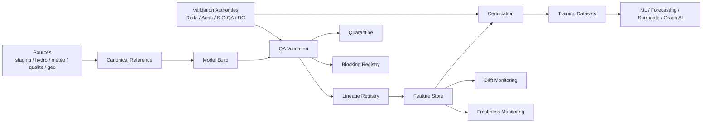

# QA & Lineage Validation Framework

| Champ | Valeur |
|---|---|
| Statut | PREPARATION_ONLY |
| Type | specification / design |
| Périmètre | QA, lineage, certification, quarantine, reproducibility, publication governance |
| Source de vérité | Non - préparation avant validations métier, modèle, SIG/QA et DG |
| Documents liés | `01_data_governance_foundation.md`, `06_model_build_specification.md`, `07_feature_store_specification.md` |
| Dernière mise à jour | 2026-05-20 |

## 1. Objectif du framework QA & Lineage

Le framework QA & Lineage protège la plateforme contre les erreurs silencieuses : leakage, confusion observed/modeled, topology non validée, unités incohérentes, outputs legacy promus trop tôt, datasets non reproductibles.

| Principe | Rôle |
|---|---|
| QA-first | aucun objet analytique ne progresse sans contrôles explicites |
| lineage | toute valeur exploitable doit pouvoir être retracée |
| reproductibilité | un dataset ou run doit pouvoir être reconstruit à version constante |
| certification | distinguer sandbox, usage scientifique, décisionnel et reporting officiel |
| quarantine | isoler les objets ambigus sans bloquer tout le pipeline |
| governance | rattacher chaque validation à une autorité |
| auditabilité | produire une preuve exploitable DG/client |
| legacy separation | empêcher `LEGACY_MODELING_TO_REPLACE` de devenir officiel |

## 2. Architecture conceptuelle



## 3. Champs standards obligatoires

Toutes les tables QA doivent intégrer conceptuellement ces champs lorsqu'ils sont applicables :

```sql
-- NON EXECUTE - SPECIFICATION ONLY
qa_rule_id uuid,
qa_rule_code text,
qa_rule_family text,
validation_scope text,
validation_level text,
validation_domain text,
validation_authority text,
canonical_entity_id uuid,
entity_type text,
feature_registry_code text,
dataset_contract_code text,
lineage_id uuid,
source_lineage_ids uuid[],
run_id uuid,
scenario_code text,
temporal_policy_code text,
data_origin text,
source_model text,
source_model_version text,
qa_status text,
qa_blocking_level text,
qa_score numeric,
confidence_score numeric,
uncertainty_class text,
anomaly_type text,
anomaly_severity text,
anomaly_status text,
quarantine_status text,
certification_scope text,
reproducibility_level text,
reproducibility_constraints jsonb,
drift_status text,
freshness_class text,
created_at timestamptz
```

## 4. DDL conceptuel non appliqué

```sql
-- NON EXECUTE - SPECIFICATION ONLY
CREATE TABLE qa.qa_rule_registry (
    qa_rule_id uuid PRIMARY KEY,
    qa_rule_code text NOT NULL UNIQUE,
    qa_rule_family text NOT NULL,
    validation_scope text NOT NULL,
    validation_level text NOT NULL,
    validation_domain text NOT NULL,
    rule_description text NOT NULL,
    blocking_default text NOT NULL,
    dataset_contract_codes text[] NOT NULL DEFAULT '{}',
    temporal_policy_code text,
    unit_policy_code text,
    validation_authority text,
    active boolean NOT NULL DEFAULT true,
    version_code text NOT NULL,
    created_at timestamptz NOT NULL DEFAULT now()
);

CREATE TABLE qa.qa_validation_runs (
    validation_run_id uuid PRIMARY KEY,
    run_code text NOT NULL UNIQUE,
    validation_scope text NOT NULL,
    target_schema text NOT NULL,
    target_table text NOT NULL,
    dataset_contract_code text,
    scenario_code text,
    model_run_id uuid,
    execution_status text NOT NULL,
    started_at timestamptz NOT NULL,
    completed_at timestamptz,
    lineage_id uuid,
    created_at timestamptz NOT NULL DEFAULT now()
);

CREATE TABLE qa.qa_validation_results (
    validation_result_id uuid PRIMARY KEY,
    validation_run_id uuid NOT NULL,
    qa_rule_id uuid,
    qa_rule_code text NOT NULL,
    target_pk text,
    canonical_entity_id uuid,
    feature_registry_code text,
    qa_status text NOT NULL,
    qa_blocking_level text NOT NULL,
    qa_score numeric,
    confidence_score numeric,
    anomaly_type text,
    anomaly_severity text,
    anomaly_status text NOT NULL DEFAULT 'OPEN',
    evidence_json jsonb NOT NULL DEFAULT '{}'::jsonb,
    lineage_id uuid,
    created_at timestamptz NOT NULL DEFAULT now()
);

CREATE TABLE qa.qa_blocking_registry (
    blocking_id uuid PRIMARY KEY,
    blocking_code text NOT NULL,
    target_scope text NOT NULL,
    target_schema text,
    target_table text,
    target_pk text,
    qa_rule_code text,
    qa_blocking_level text NOT NULL,
    blocked_action text NOT NULL,
    blocking_reason text NOT NULL,
    resolution_required_by text,
    resolution_status text NOT NULL DEFAULT 'OPEN',
    created_at timestamptz NOT NULL DEFAULT now()
);

CREATE TABLE qa.qa_quarantine_registry (
    quarantine_id uuid PRIMARY KEY,
    quarantine_scope text NOT NULL,
    target_schema text,
    target_table text,
    target_pk text,
    canonical_entity_id uuid,
    feature_registry_code text,
    reason_code text NOT NULL,
    quarantine_status text NOT NULL,
    expires_at timestamptz,
    release_condition text,
    validation_authority text,
    audit_trail jsonb NOT NULL DEFAULT '[]'::jsonb,
    lineage_id uuid,
    created_at timestamptz NOT NULL DEFAULT now()
);

CREATE TABLE qa.qa_data_anomalies (
    anomaly_id uuid PRIMARY KEY,
    anomaly_type text NOT NULL,
    anomaly_severity text NOT NULL,
    anomaly_status text NOT NULL,
    source_schema text,
    source_table text,
    source_pk text,
    canonical_entity_id uuid,
    event_time timestamptz,
    anomaly_message text,
    qa_rule_code text,
    lineage_id uuid,
    created_at timestamptz NOT NULL DEFAULT now()
);

CREATE TABLE qa.qa_spatial_validation (
    spatial_validation_id uuid PRIMARY KEY,
    canonical_entity_id uuid,
    entity_type text NOT NULL,
    srid integer,
    is_valid_geometry boolean,
    outside_basin boolean,
    duplicate_status text,
    orphan_status text,
    topology_status text,
    hydraulic_validation_status text,
    causal_confidence numeric,
    lag_uncertainty_hours numeric,
    qa_blocking_level text NOT NULL,
    validation_authority text,
    lineage_id uuid,
    created_at timestamptz NOT NULL DEFAULT now()
);

CREATE TABLE qa.qa_temporal_validation (
    temporal_validation_id uuid PRIMARY KEY,
    target_schema text NOT NULL,
    target_table text NOT NULL,
    canonical_entity_id uuid,
    temporal_policy_code text,
    date_min date,
    date_max date,
    gap_count integer,
    overlap_count integer,
    stale_count integer,
    future_timestamp_count integer,
    leakage_risk text,
    qa_blocking_level text NOT NULL,
    lineage_id uuid,
    created_at timestamptz NOT NULL DEFAULT now()
);

CREATE TABLE qa.qa_feature_validation (
    feature_validation_id uuid PRIMARY KEY,
    feature_registry_code text NOT NULL,
    dataset_contract_code text NOT NULL,
    feature_status text,
    feature_quality_score numeric,
    feature_stability_score numeric,
    stability_class text,
    volatility_type text,
    reproducibility_level text,
    deterministic boolean,
    requires_manual_inputs boolean,
    certification_scope text,
    publication_allowed boolean,
    external_reporting_allowed boolean,
    qa_blocking_level text NOT NULL,
    lineage_id uuid,
    created_at timestamptz NOT NULL DEFAULT now()
);

CREATE TABLE qa.qa_model_validation (
    model_validation_id uuid PRIMARY KEY,
    model_family text NOT NULL,
    source_model_version text,
    run_id uuid,
    scenario_code text,
    calibration_status text,
    validation_metric_json jsonb NOT NULL DEFAULT '{}'::jsonb,
    legacy_contamination boolean NOT NULL DEFAULT false,
    validation_authority text,
    qa_blocking_level text NOT NULL,
    certification_scope text,
    lineage_id uuid,
    created_at timestamptz NOT NULL DEFAULT now()
);

CREATE TABLE qa.qa_drift_monitoring (
    drift_monitoring_id uuid PRIMARY KEY,
    target_scope text NOT NULL,
    feature_registry_code text,
    model_family text,
    drift_type text NOT NULL,
    drift_score numeric,
    drift_status text NOT NULL,
    degradation_status text,
    retraining_trigger boolean NOT NULL DEFAULT false,
    recertification_required boolean NOT NULL DEFAULT false,
    created_at timestamptz NOT NULL DEFAULT now()
);

CREATE TABLE qa.qa_certification_registry (
    certification_id uuid PRIMARY KEY,
    certification_scope text NOT NULL,
    target_scope text NOT NULL,
    target_schema text,
    target_table text,
    target_pk text,
    dataset_contract_code text,
    qa_status text NOT NULL,
    lineage_id uuid,
    reproducibility_level text,
    anti_leakage_status text,
    observed_modeled_policy text,
    validation_authority text,
    certification_status text NOT NULL,
    valid_from timestamptz,
    valid_to timestamptz,
    created_at timestamptz NOT NULL DEFAULT now()
);

CREATE TABLE qa.qa_reproducibility_registry (
    reproducibility_id uuid PRIMARY KEY,
    target_scope text NOT NULL,
    target_schema text,
    target_table text,
    target_pk text,
    reproducibility_level text NOT NULL,
    deterministic boolean NOT NULL,
    reproducibility_constraints jsonb NOT NULL DEFAULT '{}'::jsonb,
    input_hash text,
    transformation_hash text,
    output_hash text,
    stable_inputs boolean,
    stable_topology boolean,
    stable_contracts boolean,
    stable_temporal_policy boolean,
    stable_units boolean,
    created_at timestamptz NOT NULL DEFAULT now()
);

CREATE TABLE qa.qa_validation_authority_actions (
    authority_action_id uuid PRIMARY KEY,
    validation_domain text NOT NULL,
    validation_authority text NOT NULL,
    validation_level text NOT NULL,
    target_scope text NOT NULL,
    target_pk text,
    action_type text NOT NULL,
    action_status text NOT NULL,
    decision_comment text,
    created_at timestamptz NOT NULL DEFAULT now()
);

CREATE TABLE qa.qa_lineage_registry (
    lineage_id uuid PRIMARY KEY,
    lineage_code text NOT NULL UNIQUE,
    parent_lineage_ids uuid[] NOT NULL DEFAULT '{}',
    lineage_scope text NOT NULL,
    source_refs jsonb NOT NULL DEFAULT '[]'::jsonb,
    transformation_name text,
    transformation_version text,
    execution_id uuid,
    input_hash text,
    output_hash text,
    created_at timestamptz NOT NULL DEFAULT now()
);

CREATE TABLE qa.qa_pipeline_execution_registry (
    execution_id uuid PRIMARY KEY,
    pipeline_code text NOT NULL,
    execution_status text NOT NULL,
    retry_count integer NOT NULL DEFAULT 0,
    qa_checkpoint_status text,
    lineage_id uuid,
    refresh_log_ref text,
    publication_log_ref text,
    reproducibility_id uuid,
    started_at timestamptz NOT NULL,
    completed_at timestamptz,
    created_at timestamptz NOT NULL DEFAULT now()
);

CREATE TABLE qa.qa_dataset_publication_registry (
    publication_id uuid PRIMARY KEY,
    publication_scope text NOT NULL,
    target_dataset_code text NOT NULL,
    certification_id uuid,
    scientific_validation_status text,
    dg_validation_status text,
    publication_status text NOT NULL,
    rollback_ref text,
    revocation_reason text,
    deprecated_by text,
    published_at timestamptz,
    created_at timestamptz NOT NULL DEFAULT now()
);
```

## 5. Table-by-table specification

| Table | Objectif | Grain | Dépendances | Usage |
|---|---|---|---|---|
| `qa_rule_registry` | catalogue des règles QA | 1 règle/version | Data governance | QA, audit, industrialisation |
| `qa_validation_runs` | runs de validation | 1 exécution QA | pipelines | audit, retries |
| `qa_validation_results` | résultats règle/objet | 1 résultat par cible/règle | rule registry | blocking, QA |
| `qa_blocking_registry` | blocages actifs | 1 blocage/action | QA results | promotion control |
| `qa_quarantine_registry` | objets isolés | 1 objet quarantiné | QA/SIG/Reda/Anas | isolation |
| `qa_data_anomalies` | anomalies data | 1 anomalie | sources métier | audit |
| `qa_spatial_validation` | validation spatiale | 1 entité/version | SIG/QA | Graph AI, model_build |
| `qa_temporal_validation` | validation temporelle | 1 source/entité | temporal policy | anti-leakage |
| `qa_feature_validation` | validation features | 1 feature/version | feature registry | ML readiness |
| `qa_model_validation` | validation runs modèles | 1 run/modèle | Reda/Anas | SWAT/WASP |
| `qa_drift_monitoring` | drift et dégradation | 1 cible/fenêtre | feature store | monitoring |
| `qa_certification_registry` | certification usage | 1 objet/scope | authorities | publication |
| `qa_reproducibility_registry` | reproductibilité | 1 objet/version | lineage/contracts | audit scientifique |
| `qa_validation_authority_actions` | décisions humaines | 1 action | Reda/Anas/SIG/DG | governance |
| `qa_lineage_registry` | graphe lineage | 1 noeud lineage | pipelines | traçabilité |
| `qa_pipeline_execution_registry` | exécutions pipelines | 1 execution | DevOps | industrialisation |
| `qa_dataset_publication_registry` | publication/rollback | 1 publication | certification/DG | DG/client |

## 6. QA rule registry

| Famille | Règles candidates | Dépendances |
|---|---|---|
| SPATIAL QA | SRID, invalid geometry, orphan entity, duplicate point, topology conflict, reach mismatch, station outside basin | SIG/QA |
| TEMPORAL QA | future timestamp, gap detection, overlap detection, stale data, impossible chronology, leakage risk | Data governance |
| HYDRO QA | negative flow, impossible hydro variability, impossible runoff ratio, unrealistic hydro peaks | QA hydro |
| QUALITY QA | impossible pH, impossible DO, impossible nutrient values, sparse inconsistency, duplicate campaigns, unit mismatch | métier qualité |
| MODEL QA | SWAT run incomplete, WASP run incomplete, missing outputs, unstable calibration, invalid scenario linkage, legacy contamination | Reda/Anas |
| FEATURE QA | leakage, stale features, missing windows, drift, impossible feature values, topology invalid, freshness expired | Feature governance |
| GRAPH QA | disconnected reach, invalid upstream/downstream, topology uncertainty, graph orphan, propagation inconsistency | SIG/QA + Anas |

## 7. QA blocking system

| Niveau | Effet | Promotion | Publication | ML | Graph AI | Refresh |
|---|---|---|---|---|---|---|
| `INFO` | trace informative | autorisée | autorisée | autorisé | autorisé | autorisé |
| `WARNING` | risque non bloquant | autorisée avec flag | autorisée interne | autorisé avec flag | selon scope | autorisé |
| `DEGRADED` | qualité réduite | pas `OFFICIAL` | pas reporting | sandbox/interne | non officiel | autorisé |
| `BLOCKING` | défaut bloquant | interdite | interdite | interdit | interdit | conditionnel |
| `QUARANTINE` | isolation | interdite | interdite | interdit | interdit | interdit sauf diagnostic |
| `CRITICAL` | risque scientifique majeur | interdite | interdite | interdit | interdit | suspendu |

## 8. Quarantine system

Objets quarantinables :

- datasets ;
- features ;
- entités canoniques ;
- reaches / topology ;
- stations / sites ;
- runs SWAT/WASP ;
- publications ;
- scénarios.

| Raison | Exemple | Validation requise |
|---|---|---|
| spatial conflict | doublon point IDP, orphan source | SIG/QA |
| temporal leakage | feature postérieure à `as_of_date` | Data governance |
| legacy contamination | output legacy utilisé comme official | Reda/Anas + governance |
| unit mismatch | µg/L non converti en mg/L | QA/métier |
| non reproducible | input hash absent | Data governance |
| false certification | certification sans autorité | DG/governance |

La sortie de quarantaine exige un audit trail, une autorité, un statut de résolution et un lineage mis à jour.

## 9. Certification framework

| Scope | Usage | Conditions minimales |
|---|---|---|
| `SANDBOX_ONLY` | expérimentation | lineage minimal, pas de publication |
| `INTERNAL_ANALYTICS` | équipe projet | QA non bloquante, freshness connue |
| `SCIENTIFIC_USE` | hydrologues/modélisateurs | QA, unités, lineage, reproductibilité contrôlée |
| `DECISION_SUPPORT` | SAD opérationnel | validation métier + anti-leakage + freshness |
| `DG_REPORTING` | reporting DG | certification DG + traçabilité |
| `OFFICIAL_REPORTING` | client/officiel | certification complète, publication gouvernée |

Conditions transverses :

- `OFFICIAL_REPORTING` interdit sur données `LEGACY`;
- spatial officiel exige SIG/QA ;
- SWAT officiel exige Reda ;
- WASP officiel exige Anas ;
- publication DG exige certification et possibilité de rollback.

## 10. Reproducibility framework

| Niveau | Définition | Conditions |
|---|---|---|
| `NONE` | non reproductible | usage interdit hors diagnostic |
| `PARTIAL` | sources connues mais transformations instables | sandbox |
| `CONTROLLED` | transformations versionnées, quelques dépendances pending | interne/scientifique limité |
| `FULL` | inputs, topology, contracts, units, temporal policy stables | scientific/decision |
| `SCIENTIFIC_GRADE` | reproductibilité complète + validation scientifique | official candidate |

Champs conceptuels :

- `reproducibility_level`;
- `reproducibility_constraints`;
- `deterministic`;
- `requires_manual_inputs`;
- `input_hash`;
- `transformation_hash`;
- `output_hash`;
- `stable_topology`;
- `stable_contracts`;
- `stable_units`.

## 11. Lineage framework

Types de lineage :

| Type | Description |
|---|---|
| transformation lineage | source -> transformation -> cible |
| feature lineage | model_build -> feature |
| model run lineage | inputs + paramètres + scénario -> outputs |
| scenario lineage | parent scenario -> version |
| dataset lineage | features + windows -> training dataset |
| publication lineage | dataset/certification -> publication |

Règles :

- lineage propagé par `lineage_id` et `source_lineage_ids`;
- hash obligatoire pour inputs critiques ;
- parent lineage obligatoire pour dérivations ;
- lineage graph exploitable pour audit DG/client ;
- aucune certification haute sans lineage complet.

## 12. Drift & degradation

| Type | Exemple | Trigger |
|---|---|---|
| drift | distribution feature change | monitoring threshold |
| freshness degradation | trop de `STALE` | refresh/rebuild |
| topology degradation | nouveau conflit reach | SIG/QA recertification |
| sensor degradation | station dérive | QA station |
| feature degradation | quality score baisse | dataset blocking |
| model degradation | métriques calibration chutent | Reda/Anas |
| calibration degradation | paramètres instables | scientific revalidation |

Effets possibles : warning, blocage, retraining, revalidation, recertification, quarantine.

## 13. Pipeline execution registry

Le registre d'exécution doit tracer :

- run history ;
- execution status ;
- retries ;
- QA checkpoints ;
- lineage propagation ;
- refresh logs ;
- publication logs ;
- reproducibility logs.

Règle : un pipeline peut produire un artefact, mais seul un pipeline avec QA checkpoint réussi peut produire un artefact certifiable.

## 14. Publication governance

| Publication | Autorité | Conditions |
|---|---|---|
| dataset publication | Data governance + QA | contract ACTIVE, QA passed |
| feature publication | QA + domaine | feature VALIDATED/ACTIVE |
| dashboard publication | métier + DG selon usage | certification scope compatible |
| API publication | backend + governance | contract stable |
| official reporting | DG/client | certification complète |

Actions obligatoires :

- approval ;
- publication log ;
- rollback reference ;
- revocation path ;
- deprecation policy.

## 15. Graph AI QA preparation

Concepts uniquement, aucun Graph AI à implémenter :

| Objet | QA requise |
|---|---|
| topology confidence | score + validation SIG |
| propagation consistency | upstream/downstream cohérent |
| node certification | stations/sites/reaches certifiés |
| edge certification | reach validé et non quarantiné |
| graph reproducibility | graphe versionné, hashé |
| graph quarantine | sous-graphe isolé si conflit |

Règle : aucune propagation officielle sans `hydraulic_validation_status` acceptable et `causal_confidence` documenté.

## 16. Risques

| Risque | Impact | Mitigation |
|---|---|---|
| silent leakage | scores ML faux | temporal QA + blocking |
| hidden topology errors | propagation fausse | spatial QA + graph quarantine |
| legacy contamination | outputs non officiels utilisés | certification scope |
| unit drift | erreurs scientifiques | unit QA |
| freshness collapse | features obsolètes | freshness monitoring |
| reproducibility illusion | audit impossible | hashes + reproducibility registry |
| non deterministic transforms | résultats instables | deterministic flag |
| unresolved spatial conflicts | mauvais liens | quarantine |
| orphan entities | perte ou faux rattachement | orphan QA |
| duplicate campaigns | biais ML | duplicate QA |
| false certification | confiance indue | validation authority actions |
| model misuse | mauvais usage SWAT/WASP | model QA |
| graph hallucination | causalité inventée | causal confidence + topology status |

## 17. TO_VALIDATE

### TO_VALIDATE_WITH_REDA

- règles QA SWAT/SWAT+ ;
- critères run incomplete / calibration unstable ;
- seuils certification scientifique SWAT ;
- autorité `SCIENTIFIC_GRADE` SWAT ;
- conditions de sortie legacy.

### TO_VALIDATE_WITH_ANAS

- règles QA WASP ;
- unités et variables obligatoires ;
- validation boundary conditions ;
- causal confidence pour propagation ;
- conditions de sortie legacy.

### TO_VALIDATE_WITH_SIG_QA

- règles spatial QA ;
- seuils duplicate/orphan/conflict ;
- topology confidence ;
- hydraulic validation status ;
- graph quarantine.

### TO_VALIDATE_WITH_DATA_GOVERNANCE

- niveaux blocking ;
- contrats QA ;
- lineage minimal ;
- reproducibility levels ;
- certification scopes ;
- quarantine release policy.

### TO_VALIDATE_WITH_DG

- publication governance ;
- scope `DG_REPORTING` et `OFFICIAL_REPORTING` ;
- révocation et rollback ;
- responsabilités d'approbation ;
- audit client.

