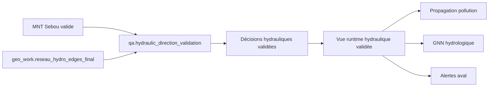

# Impact futur pollution / IA / ML

## Ce qui reste bloqué
- GNN directionnel hydrologique.
- Propagation pollution scientifiquement orientée.
- Temps d'arrivée aval.
- Routage hydraulique réglementaire/diagnostic.
- Scoring transport pollution.

## Ce qui devient possible après validation QA
- Graphe hydrologique orienté fiable.
- Simulation de propagation aval.
- Estimation temps de transit avec pente/longueur.
- Alertes barrage/station aval.
- Features hydrauliques pour ML/GNN/LSTM.
- Recommandations automatiques avec traçabilité directionnelle.

## Architecture cible

## Règle de gouvernance
Le futur moteur pollution/GNN ne doit consommer que des directions portant un statut validé ou explicitement marqué incertain. Les segments `FLOW_REVERSED_SUSPECTED` et `FLAT_SEGMENT` ne doivent jamais être traités comme vérité silencieuse.
