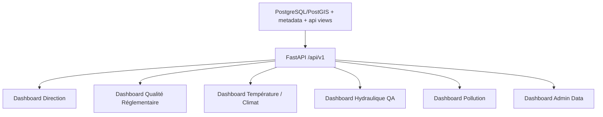

# Architecture cible dashboards

## Principe
Séparer les dashboards par usage métier, pas par historique technique. Les dashboards legacy restent disponibles en DEV le temps de stabiliser les écrans cibles.

## A. Dashboard Direction
Rôle : vision DG.

Contenu :
- KPI qualité réglementaire.
- Stations/sites à risque.
- Couverture données.
- Statut global bassin.
- Alertes et blocages.

Sources :
- `/api/v1/quality/regulatory-status`
- `/api/v1/map/latest-values`
- futures vues analytics consolidées.

## B. Dashboard Qualité Réglementaire
Rôle : équipe qualité.

Contenu :
- Classification par station/site.
- Paramètres classifiables.
- Paramètres non classifiables.
- Seuils actifs.
- Version réglementaire affichée.
- `type_eau=surface_generale` affiché.

Sources :
- `/api/v1/quality/thresholds`
- `/api/v1/quality/classify`
- `/api/v1/quality/global-index`
- `/api/v1/qualite/*`

## C. Dashboard Température / Climat
Rôle : climat, météo, ML features.

Contenu :
- Séries T_Min / T_Max / T_Moy.
- Filtres station/période.
- Batch température.
- Contrôles QA.

Source :
- `meteo.mesure_temperature`
- endpoints `/observatory/temperature/*` ou nouveaux endpoints climat alignés.

## D. Dashboard Hydraulique QA
Rôle : équipe hydrologie.

Contenu :
- Segments confirmés.
- Inversions suspectées.
- Segments plats.
- MNT.
- Workflow QGIS/MapLibre.

Source :
- `geo_work.reseau_hydro_edges_final`
- future `qa.hydraulic_direction_validation`
- package QGIS `docs/43_hydraulic_arbitration_qgis_package`

## E. Dashboard Pollution
Rôle : pollution et IDP.

Contenu :
- Sites pollution.
- Typologie source.
- Derniers résultats qualité.
- Statut réglementaire.
- Routage topologique marqué non scientifique tant que hydraulique non validée.

Sources :
- `/api/v1/pollution/sites.geojson`
- `/api/v1/pollution/latest-results`
- `/api/v1/routing/*` avec warnings.

## F. Dashboard Admin Data
Rôle : data/dev/gouvernance.

Contenu :
- Batchs.
- Lineage.
- QA tables.
- Endpoints disponibles.
- Tables vides ou obsolètes.
- Statuts de vues matérialisées.

Sources :
- `/api/v1/admin/data-availability`
- `/api/v1/observatory/mviews/status`
- DB metadata/audit en lecture.

## Architecture recommandée

