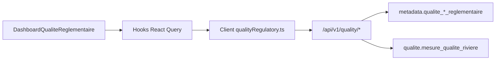

# Architecture dashboard qualité réglementaire

## Route

`/dashboard-qualite-reglementaire`

## Flux

## Chargement

1. Au démarrage : statut réglementaire, seuils actifs et stations.
2. Après sélection station : séries temporelles filtrées QA.
3. Après réception série : classification de la dernière valeur du paramètre choisi.

Le dashboard reste lecture seule. Les alertes agrégées, la comparaison multi-stations et l’historique des classes sont différés en P1.
