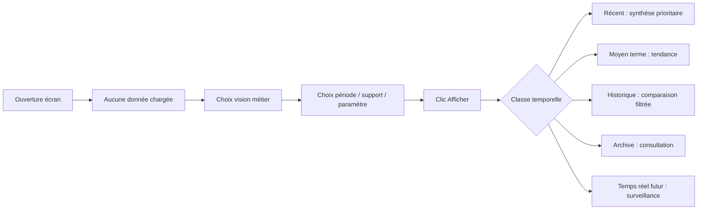

# Historique vs récent

## Typologie

| Classe | Définition | Comportement dashboard | Comportement carte | Comportement API | Comportement cache | Comportement frontend |
|---|---|---|---|---|---|---|
| Temps réel | capteurs futurs | surveillance / alerte | points actifs | endpoints dédiés futurs | très court | push / refresh fréquent futur |
| Récent | 0-12 mois | défaut décisionnel | synthèse prioritaire | filtre par défaut recommandé | court | chargement après clic |
| Moyen terme | 1-5 ans | tendance | carte filtrée | plage temporelle explicite | moyen | comparaison manuelle |
| Historique | >5 ans | comparaison | éviter surcharge | filtres obligatoires | moyen / long | accès volontaire |
| Archive | données anciennes ou remplacées | consultation | souvent hors carte par défaut | endpoint / vue dédiée ou filtre archive | long | modules secondaires |

## Stratégie métier

- le récent est la vue par défaut ;
- l'historique est accessible mais jamais imposé ;
- l'archive doit être explicite ;
- les campagnes doivent rester séparées du courant ;
- le temps réel ne doit pas hériter des règles cache du batch historique.

## Schéma

## Risques

- mélange récent / historique dans la même carte ;
- absence de filtre date sur vues volumétriques ;
- surcharge API si carte globale non filtrée ;
- confusion campagne ponctuelle vs série continue.
