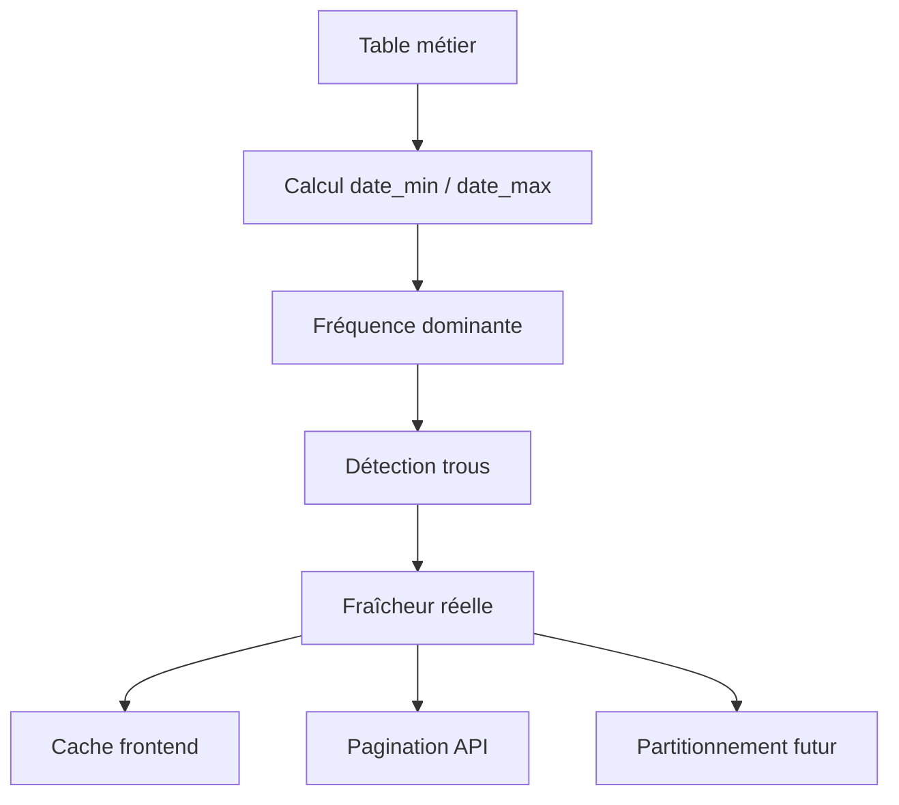

# Risques, readiness et checklist

## Risques

| Risque | Impact | Gravité | Réponse |
|---|---|---|---|
| bornes temporelles inconnues | mauvaise lecture métier du récent | élevée | exécuter audit SQL read-only |
| tables volumineuses sans fenêtre temps | latence API / frontend | élevée | filtres date obligatoires |
| trous temporels non identifiés | faux diagnostic de fraîcheur | élevée | calculer gaps par support |
| pollution sans date consolidée | mauvaise lecture campagne | moyenne | appui sur `date_reception` puis validation métier |
| SWAT/WASP sans profil temporel consolidé | mauvaise anticipation infra | moyenne | audit par scénario / run |

## Readiness

- audit temporalité : `READY_TO_EXECUTE_READ_ONLY`
- cache frontend : `READY_FOR_TUNING`
- pagination API : `READY_FOR_TUNING`
- partitionnement futur : `GO_CONCEPTION`

## Diagramme

## Checklist validation

| Question | Oui/Non | Commentaire |
|---|---|---|
| Les bornes temporelles réelles ont-elles été calculées ? | | |
| Les trous temporels significatifs sont-ils identifiés ? | | |
| La volumétrie récente 30/90/365 jours est-elle connue ? | | |
| Les recommandations de cache sont-elles alignées métier ? | | |
| Les recommandations de pagination sont-elles compatibles frontend ? | | |
| Les recommandations de partitionnement futur sont-elles suffisantes ? | | |
