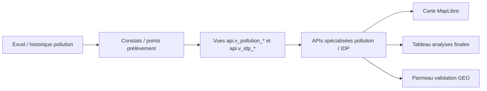

# Architecture cible API / frontend / cartographie

## APIs cibles

| Endpoint cible | Vue cible | Usage |
|---|---|---|
| `/api/v1/pollution/constat-prealable` | `api.v_pollution_constat_prealable` | constats terrain |
| `/api/v1/pollution/analyses-finales` | `api.v_pollution_analyses_finales` | mesures labo |
| `/api/v1/idp/points` | `api.v_idp_points` | points résolus |
| `/api/v1/idp/non-resolus` | `api.v_idp_points_non_resolus` | points à traiter GEO |
| `/api/v1/pollution/sources` | `api.v_pollution_sources` cible | sources pollution |

## Composants frontend cibles

| Composant | Rôle |
|---|---|
| `PollutionModeSelector` | bascule constat / analyses / non résolus |
| `PollutionCampaignFilter` | filtre campagne / lot |
| `PollutionMapPanel` | couche cartographique MapLibre dédiée |
| `PollutionDetailsTable` | détail constats / analyses |
| `PollutionGeoReviewPanel` | revue GEO des points non résolus |
| `PollutionQaStatusBadge` | affichage QA/GEO |
| `PollutionTimelinePanel` | évolution campagne / lot |

## Couches MapLibre cibles

| Couche | Source | Style |
|---|---|---|
| points résolus | `api.v_idp_points` | points par type / statut |
| points non résolus | `api.v_idp_points_non_resolus` | points contrastés + priorité revue |
| constats préalables | `api.v_pollution_constat_prealable` | points / clusters |
| analyses finales | `api.v_pollution_analyses_finales` | points + popup analytique |

## Diagramme d'architecture

## Principes UX

- afficher la couche `points non résolus` séparément ;
- clusters par défaut si densité élevée ;
- analyses finales accessibles après sélection volontaire ;
- aucun chargement massif à l'ouverture ;
- filtres campagne, statut GEO, statut QA et période obligatoires sur écrans lourds.
