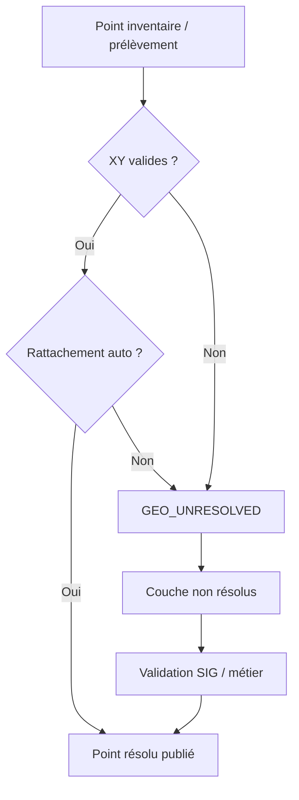

# Workflows GEO / QA / résolution progressive

## Workflow GEO

1. ingestion constat / prélèvement ;
2. validation XY ;
3. tentative de rattachement automatique ;
4. si échec, marquer `GEO_UNRESOLVED` ;
5. publication dans couche dédiée ;
6. revue métier / SIG ;
7. reclassification en point résolu.

## Workflow QA

1. conserver `valeur_raw` ;
2. détecter absence numérique, unité incohérente, mapping paramètre manquant ;
3. publier avec `qa_status` explicite ;
4. ne pas masquer les lignes ambiguës si elles restent utiles en revue.

## Stratégie de résolution géographique

- phase 1 : points avec XY valides publiés immédiatement ;
- phase 2 : points ambiguës mais exploitables publiés en revue ;
- phase 3 : points sans rattachement stable conservés dans une file GEO ;
- phase 4 : enrichissement par couches de référence et validation humaine.

## Mermaid

