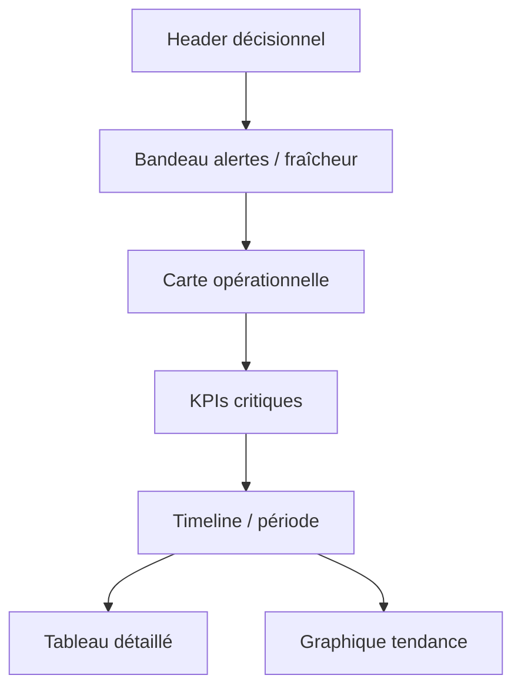
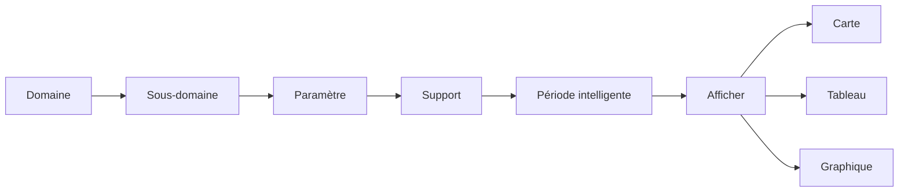

# Wireframes Mermaid et composants cibles

## Wireframe global

## Wireframe analyste

## Composants React cibles

| Composant | Rôle |
|---|---|
| `DecisionExecutiveBanner` | alertes et fraîcheur |
| `DecisionOperationalMap` | carte opérationnelle priorisant le récent |
| `DecisionTimeline` | navigation temporelle intelligente |
| `DecisionSmartPeriodSelector` | préréglages récent / historique / archive |
| `DecisionAnomalyPanel` | anomalies et points critiques |
| `DecisionSupportSwitcher` | bascule multi-support |
| `DecisionTrendPanel` | tendances |
| `DecisionComparisonTable` | détail filtré |

## Règles de densité

- cluster par défaut au-delà d'un seuil configurable ;
- heatmap uniquement pour couches à forte densité et non pour les points critiques individuels ;
- timeline découplée du chargement initial.
