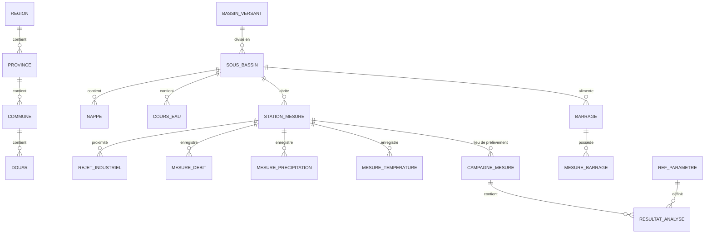

# Dictionnaire de Données & Modèle Conceptuel (MCD)

## 1. Modèle Conceptuel de Données (MCD - Vue Macro)

Le MCD reflète désormais l'urbanisation en schémas métier (`infra`, `geo`, `qualite`, `hydro`, `meteo`).

---

## 2. Conventions de Typage (PostgreSQL / PostGIS)

| Type Conceptuel | Type PostgreSQL | Usage |
| :--- | :--- | :--- |
| Identifiant Unique | `UUID` | Clés primaires générées par `uuid-ossp`. |
| Géométrie | `GEOMETRY(Point/Polygon, 4326)` | Stockage WGS84 obligatoire pour l'API. |
| Séries Temporelles | `TIMESTAMPTZ` | Horodatage avec fuseau horaire. |

---

## 3. Dictionnaire de Données par Schéma

### 3.1. Schéma `infra` (Infrastructures)

#### Table : `infra.station_mesure`
| Colonne | Type | Contrainte | Description |
| :--- | :--- | :--- | :--- |
| `id` | `UUID` | PK | Identifiant unique |
| `code_station` | `VARCHAR(50)` | UNIQUE | Code historique |
| `nom` | `VARCHAR(255)` | NOT NULL | Libellé station |
| `type_station` | `VARCHAR(50)` | | Qualité, Hydro, Meteo |
| `geom` | `GEOMETRY(Point, 4326)` | | Localisation WGS84 |

#### Table : `infra.barrage`
| Colonne | Type | Contrainte | Description |
| :--- | :--- | :--- | :--- |
| `id` | `UUID` | PK | |
| `nom` | `VARCHAR(100)` | NOT NULL | |
| `capacite_normale_mm3`| `NUMERIC(10,2)` | | |

### 3.2. Schéma `qualite` (Qualité des Eaux)

#### Table : `qualite.ref_parametre`
| Colonne | Type | Contrainte | Description |
| :--- | :--- | :--- | :--- |
| `id` | `UUID` | PK | Identifiant du paramètre |
| `code_abrege` | `VARCHAR(50)` | UNIQUE | ex: DBO5 |
| `nom_complet` | `VARCHAR(255)` | | |
| `unite` | `VARCHAR(50)` | | |

#### Table : `qualite.campagne_mesure`
| Colonne | Type | Contrainte | Description |
| :--- | :--- | :--- | :--- |
| `id` | `UUID` | PK | |
| `station_id` | `UUID` | FK | Station de prélèvement |
| `date_prelevement` | `TIMESTAMPTZ` | | Horodatage |

#### Table : `qualite.resultat_analyse`
| Colonne | Type | Contrainte | Description |
| :--- | :--- | :--- | :--- |
| `campagne_id` | `UUID` | FK | |
| `param_code` | `VARCHAR(50)` | | Code paramètre |
| `valeur` | `NUMERIC(10,3)` | | Résultat |

---

## 4. Vues d'Exposition (Schéma `api`)

| Vue | Description | Usage Dashboard |
| :--- | :--- | :--- |
| `api.v_station_dimension` | Liste des stations actives | Sidebar / Filtres |
| `api.v_station_geojson` | Couche spatiale WGS84 | Mapbox / Leaflet |
| `api.v_barrage_dimension` | Caractéristiques barrages | Dashboard Hydro |

---

## 5. Audit & Qualité (Phase C)
- **Taux de mapping** : 100% réussi sur les stations principales.
- **Intégrité spatiale** : Toutes les géométries sont valides (`ST_IsValid`).
- **Standardisation** : Utilisation systématique de `UUID` pour les pivots inter-schémas.
