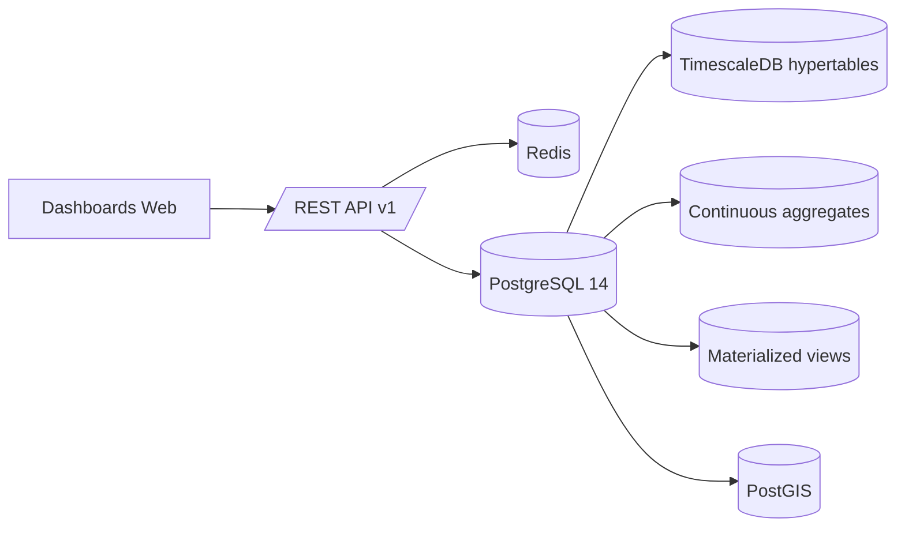

# Architecture API et Vues Dashboard - WaterQual SEBOU

## 1. Objectif
Ce document décrit une architecture API REST versionnée, les conventions de réponses JSON, les vues SQL optimisées et la matrice d'alimentation des dashboards du projet WaterQual SEBOU.

Les objets SQL décrits ici sont créés par le script [12_api_views.sql](/c:/dev/Postgresql_server/db_scripts/12_api_views.sql).

## 2. Vue d'ensemble



Principes:
- `api/v1` comme préfixe unique.
- Ressources métiers groupées par domaine.
- Réponses homogènes avec `data`, `meta`, `links`, `errors`.
- Les dashboards consomment d'abord les agrégats et vues matérialisées, puis les tables brutes seulement pour zoom fin et export.
- Les couches cartographiques retournent du `GeoJSON` si `format=geojson`.

## 3. Conventions REST

### 3.1. Nommage
- URL en minuscules et pluriels: `/api/v1/infra/stations`
- Agrégats explicités dans les paramètres, pas dans les chemins si la logique est commune.
- Domaines recommandés:
  - `/admin`
  - `/geo`
  - `/infra`
  - `/hydro`
  - `/meteo`
  - `/qualite`
  - `/map`
  - `/raw`
  - `/exports`

### 3.2. Paramètres communs
| Paramètre | Type | Rôle |
|---|---|---|
| `from`, `to` | ISO 8601 | bornes temporelles |
| `timezone` | string | ex. `Africa/Casablanca` |
| `aggregate` | enum | `raw`, `hour`, `day`, `week`, `month`, `year` |
| `stat` | enum | `avg`, `sum`, `min`, `max`, `count`, `p95` |
| `page`, `page_size` | integer | pagination classique |
| `cursor` | string | pagination temporelle |
| `sort` | string | `temps,-temps,valeur,-valeur` |
| `format` | enum | `json`, `geojson`, `csv` |
| `bbox` | string | `minLon,minLat,maxLon,maxLat` |
| `station_id`, `station_ids[]` | uuid | filtre station |
| `bassin_id`, `sous_bassin_id` | integer | filtre géographique |
| `param_code`, `param_codes[]` | string | filtre qualité |

### 3.3. Modèle de réponse standard
```json
{
  "data": [],
  "meta": {
    "request_id": "6af9a2d0-6d6c-4be2-b82e-1cd3271962f6",
    "page": 1,
    "page_size": 100,
    "total_items": 1000,
    "total_pages": 10,
    "aggregation": "day",
    "time_range": {
      "from": "2025-01-01T00:00:00Z",
      "to": "2025-01-31T23:59:59Z",
      "timezone": "Africa/Casablanca"
    },
    "filters": {
      "station_ids": ["7f6d..."],
      "param_codes": ["NO3"]
    }
  },
  "links": {
    "self": "/api/v1/qualite/analyses/timeseries?...",
    "next": null
  },
  "errors": []
}
```

### 3.4. Erreurs
```json
{
  "data": null,
  "meta": {
    "request_id": "f8220adf-cd53-4fcb-903b-c5fded7cbeaf"
  },
  "errors": [
    {
      "code": "INVALID_DATE_RANGE",
      "message": "Parameter from must be earlier than to",
      "field": "from"
    }
  ]
}
```

## 4. Catalogue des endpoints

### 4.1. Référentiels et géographie
| Endpoint | Méthode | Description |
|---|---|---|
| `/api/v1/admin/parametres` | GET | liste du catalogue des paramètres |
| `/api/v1/admin/organismes` | GET | liste des organismes |
| `/api/v1/geo/bassins` | GET | bassins versants en JSON ou GeoJSON |
| `/api/v1/geo/sous-bassins` | GET | sous-bassins avec filtres |
| `/api/v1/geo/cours-eau` | GET | réseau hydrographique |
| `/api/v1/infra/stations` | GET | stations enrichies et filtrables |
| `/api/v1/infra/stations/{stationId}` | GET | détail station |
| `/api/v1/infra/barrages` | GET | barrages enrichis |

### 4.2. Climat
| Endpoint | Méthode | Description |
|---|---|---|
| `/api/v1/meteo/precipitations/timeseries` | GET | précipitations brutes ou agrégées |
| `/api/v1/meteo/temperatures/timeseries` | GET | températures min/max/moy |
| `/api/v1/meteo/precipitations/latest` | GET | dernier relevé par station |
| `/api/v1/meteo/temperatures/latest` | GET | dernier relevé par station |

### 4.3. Hydrologie
| Endpoint | Méthode | Description |
|---|---|---|
| `/api/v1/hydro/debits/timeseries` | GET | débit brut ou agrégé |
| `/api/v1/hydro/debits/fdc` | GET | courbe de débit classé |
| `/api/v1/hydro/barrages/timeseries` | GET | cote, volume, lâcher |
| `/api/v1/hydro/debits/latest` | GET | dernier débit valide |

### 4.4. Qualité
| Endpoint | Méthode | Description |
|---|---|---|
| `/api/v1/qualite/analyses/timeseries` | GET | séries qualité par paramètre |
| `/api/v1/qualite/analyses/latest` | GET | dernier résultat par station et paramètre |
| `/api/v1/qualite/conformite` | GET | conformité aux normes |
| `/api/v1/qualite/campagnes` | GET | campagnes de prélèvement |

### 4.5. Dashboard cartographique
| Endpoint | Méthode | Description |
|---|---|---|
| `/api/v1/map/overview` | GET | KPI principaux |
| `/api/v1/map/layers/stations` | GET | stations GeoJSON |
| `/api/v1/map/layers/barrages` | GET | barrages GeoJSON |
| `/api/v1/map/layers/quality-status` | GET | couche statut qualité |
| `/api/v1/map/layers/sous-bassins` | GET | sous-bassins GeoJSON |

### 4.6. Données brutes et export
| Endpoint | Méthode | Description |
|---|---|---|
| `/api/v1/raw/{schema}/{table}` | GET | lecture paginée de table |
| `/api/v1/raw/{schema}/{table}` | POST | insertion |
| `/api/v1/raw/{schema}/{table}/{id}` | PUT | mise à jour |
| `/api/v1/raw/{schema}/{table}/{id}` | DELETE | suppression logique ou physique |
| `/api/v1/exports` | POST | export Excel/PDF |

## 5. Mapping Endpoints x Dashboards

| Dashboard | Widgets / besoins | Endpoints | Paramètres clés | Cache recommandé |
|---|---|---|---|---|
| Climat | séries précipitation | `/meteo/precipitations/timeseries` | `station_ids[]`, `aggregate`, `from`, `to`, `stat=sum` | 5 à 15 min |
| Climat | séries température | `/meteo/temperatures/timeseries` | `station_ids[]`, `aggregate`, `from`, `to` | 5 à 15 min |
| Hydrologie simple | courbe débit | `/hydro/debits/timeseries` | `station_id`, `aggregate`, `from`, `to` | 5 min |
| Hydrologie multi-scénarios | comparaison séries | `/hydro/debits/timeseries` | `station_id`, `scenario[]`, `aggregate` | clé cache par scénario |
| Hydrologie FDC | courbe classée | `/hydro/debits/fdc` | `station_id`, `from`, `to` | 30 min |
| Qualité | évolution NO3, O2, P | `/qualite/analyses/timeseries` | `station_ids[]`, `param_codes[]`, `aggregate`, `from`, `to` | 15 min |
| Qualité | conformité | `/qualite/conformite` | `station_ids[]`, `param_codes[]`, `from`, `to` | 15 min |
| Principal carte | KPI globaux | `/map/overview` | `bassin_id`, `sous_bassin_id`, `from`, `to` | 1 à 5 min |
| Principal carte | stations interactives | `/map/layers/stations` | `bbox`, `type_station`, `actif` | 1 à 5 min |
| Principal carte | état qualité | `/map/layers/quality-status` | `bbox`, `bassin_id`, `from`, `to` | 1 à 5 min |
| Données brutes | CRUD / audit | `/raw/{schema}/{table}` | `page`, `page_size`, `sort`, filtres colonne | sans cache |

## 6. Pagination et séries volumineuses
- Pagination classique `page/page_size` pour référentiels et tables CRUD.
- Pagination par curseur pour les séries temporelles.
- Refuser les séries brutes au-delà de `10000` points par requête.
- Si `aggregate=raw` et volume estimé trop élevé, répondre `422`.

## 7. Couche SQL optimisée
Objets créés:
- `api.v_station_dimension`
- `api.v_barrage_dimension`
- `api.v_qualite_mesures_enrichies`
- `api.v_station_geojson`
- `api.v_barrage_geojson`
- `api.ca_hydro_debit_day`
- `api.ca_meteo_precip_day`
- `api.ca_meteo_temp_day`
- `api.ca_hydro_barrage_day`
- `api.mv_qualite_month`
- `api.mv_station_latest_status`
- `api.v_station_status_geojson`

## 8. Recommandations de performance
- Compresser les hypertables après 90 jours.
- Segmenter la compression par identifiant de station ou barrage.
- Toujours filtrer par plage temporelle avant agrégation.
- Préférer les vues matérialisées pour la carte et la qualité consolidée.
- Ajouter Redis pour cache applicatif:
  - 1 à 5 min pour carte
  - 5 à 15 min pour agrégats
  - 1 h ou plus pour référentiels
- Ajouter `ETag` et `Cache-Control` sur les endpoints stables.

## 9. Ordre d'exécution SQL
Ajouter le script suivant après les scripts de structure et de sécurité:

```bash
psql -U postgres -d sad_abhs -f 12_api_views.sql
```
