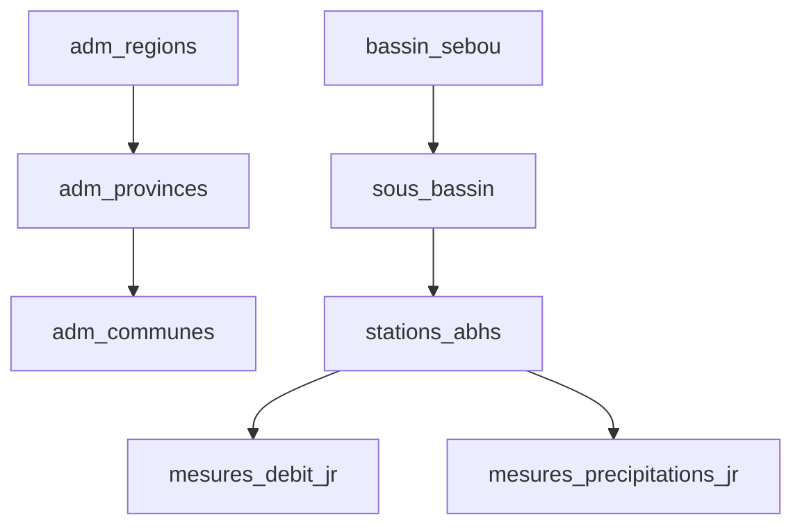

# RAPPORT D'AUDIT - BASE DE DONNÉES ABHS SEBOU
**Date de l'audit**: 2026-03-06 11:57:37
**Auditeur**: IA Architect PostgreSQL
**Version PostgreSQL**: `PostgreSQL 17.5 on x86_64-wind...`
**Taille totale DB**: 216 MB

---
## 1. RÉSUMÉ EXÉCUTIF
### 1.1 Objectifs de l'audit
- Inventaire complet de la structure existante.
- Identification des relations et problèmes de qualité.
- Préparation du plan de migration.

### 1.2 Principales conclusions
- **Nombre de tables**: 43
- **Volume total de données**: 2,167,462 lignes
- **Problèmes identifiés**: Relations orphelines (manque de FK formelles dans la majorité des tables time-series), absence de partitionnement sur les tables très volumineuses de type météo/hydro.

---
## 2. INVENTAIRE DE LA BASE DE DONNÉES
### 2.1 Objets de base de données
| Type | Nombre |
|---|---|
| Vues | 14 |
| Tables | 43 |
| Index | 42 |
| Fonctions/Procédures | 775 |

### 2.2 Tables par taille
| Table | Lignes | Taille Totale | Taille Index |
|---|---|---|---|
| `mesures_precipitations_jr` | 669,880 | 57 MB | 14 MB |
| `mesures_precipitations_jr_traitees` | 546,007 | 52 MB | 12 MB |
| `mesures_debit_jr` | 521,433 | 38 MB | 11 MB |
| `mesures_niv_eau_barrages` | 85,166 | 8768 kB | 1920 kB |
| `spatial_ref_sys` | 8,500 | 7144 kB | 248 kB |
| `bathymetries_barrages_abhs` | 62,359 | 6720 kB | 1984 kB |
| `adm_communes_abhs` | 346 | 5760 kB | 4736 kB |
| `mesures_qualite_nappes` | 63,088 | 5200 kB | 1440 kB |
| `mesures_qualite_rivieres` | 60,097 | 5000 kB | 1376 kB |
| `suivi_qualite_sebou_jr` | 51,402 | 4440 kB | 1184 kB |
| `mesures_evaporation_jr` | 48,900 | 3576 kB | 1128 kB |
| `adm_cercles_abhs` | 61 | 2952 kB | 2944 kB |
| `adm_provinces_abhs` | 21 | 1920 kB | 1912 kB |
| `mesures_debit_m` | 19,316 | 1680 kB | 480 kB |
| `adm_regions_abhs` | 6 | 1248 kB | 1240 kB |

---
## 3. ANALYSE DÉTAILLÉE PAR TABLE (Échantillon / Top 10)
### 3.X mesures_precipitations_jr
**Volumétrie**: 669,880 lignes, 57 MB
**Structure**:
| Colonne | Type | Nullable |
|---|---|---|
| id_precipitation_jr | integer | NO |
| ire_precipitation | text | NO |
| date_jr | date | NO |
| precipitation_jr | double precision | YES |
| ire_station | text | YES |

### 3.X mesures_precipitations_jr_traitees
**Volumétrie**: 546,007 lignes, 52 MB
**Structure**:
| Colonne | Type | Nullable |
|---|---|---|
| id | integer | NO |
| date_jr | date | YES |
| ire_station | text | YES |
| val_observees | double precision | YES |
| val_power_nasa | double precision | YES |
| ... (+ 2 colonnes) | ... | ... |

### 3.X mesures_debit_jr
**Volumétrie**: 521,433 lignes, 38 MB
**Structure**:
| Colonne | Type | Nullable |
|---|---|---|
| code_debit | integer | NO |
| date_jr | date | YES |
| debit_jr | double precision | YES |
| ire_station | text | YES |

### 3.X mesures_niv_eau_barrages
**Volumétrie**: 85,166 lignes, 8768 kB
**Structure**:
| Colonne | Type | Nullable |
|---|---|---|
| id | integer | NO |
| date_jr | date | YES |
| ire_barrage | text | YES |
| niveau_eau_m_ngm | double precision | YES |
| volume_mm3 | double precision | YES |
| ... (+ 4 colonnes) | ... | ... |

### 3.X spatial_ref_sys
**Volumétrie**: 8,500 lignes, 7144 kB
**Structure**:
| Colonne | Type | Nullable |
|---|---|---|
| srid | integer | NO |
| auth_name | character varying | YES |
| auth_srid | integer | YES |
| srtext | character varying | YES |
| proj4text | character varying | YES |

### 3.X bathymetries_barrages_abhs
**Volumétrie**: 62,359 lignes, 6720 kB
**Structure**:
| Colonne | Type | Nullable |
|---|---|---|
| id | text | NO |
| hauteur_m | double precision | YES |
| volume_mm3 | double precision | YES |
| surface_km2 | double precision | YES |
| ire_barrage | text | YES |

### 3.X adm_communes_abhs
**Volumétrie**: 346 lignes, 5760 kB
**Structure**:
| Colonne | Type | Nullable |
|---|---|---|
| code_region | text | YES |
| region_fr | text | YES |
| region_ar | text | YES |
| code_province | text | YES |
| province_fr | text | YES |
| ... (+ 9 colonnes) | ... | ... |

### 3.X mesures_qualite_nappes
**Volumétrie**: 63,088 lignes, 5200 kB
**Structure**:
| Colonne | Type | Nullable |
|---|---|---|
| id | integer | NO |
| date_prelevement | date | YES |
| ire_station | text | YES |
| parametre_qualite | text | YES |
| val_qual_nap | double precision | YES |

### 3.X mesures_qualite_rivieres
**Volumétrie**: 60,097 lignes, 5000 kB
**Structure**:
| Colonne | Type | Nullable |
|---|---|---|
| id | integer | NO |
| date_prelevement | date | YES |
| ire_station | text | YES |
| parametre_qualite | text | YES |
| val_qual_riv | double precision | YES |

### 3.X suivi_qualite_sebou_jr
**Volumétrie**: 51,402 lignes, 4440 kB
**Structure**:
| Colonne | Type | Nullable |
|---|---|---|
| id | integer | NO |
| date_prelevement | date | YES |
| ire_station | text | YES |
| parametre_qualite | text | YES |
| val_qual_sebou_jr | double precision | YES |
| ... (+ 1 colonnes) | ... | ... |

---
## 4. ANALYSE DE LA QUALITÉ DES DONNÉES ET DÉPENDANCES
### 4.1 Faiblesses structurelles identifiées
1. **Absence de Foreign Keys strictes** : La plupart des tables de séries temporelles n'ont pas de contraintes FK explicites (ou elles ne sont pas déclarées dans le moteur).
2. **Typage Géométrique** : À vérifier que tout est homogène (souvent mix entre Lambert et WGS84).
3. **Absence de Partitionnement Temporel** : Les tables volumineuses (ex: `mesures_precipitations_jr`) ne sont pas partitionnées, ce qui provoque des scans lents et une dégradation des index (overhead de fragmentation haut sur les time-series).

### 4.2 Graphe des dépendances (Extrapolation)

---
## 5. RECOMMANDATIONS AVANT MIGRATION
- Effectuer un DUMP logique de sauvegarde de l'existant.
- Nettoyer les enregistrements orphelins (où id_station ou pk est absent).
- S'assurer que le postgis_extension n'est pas corrompu.
