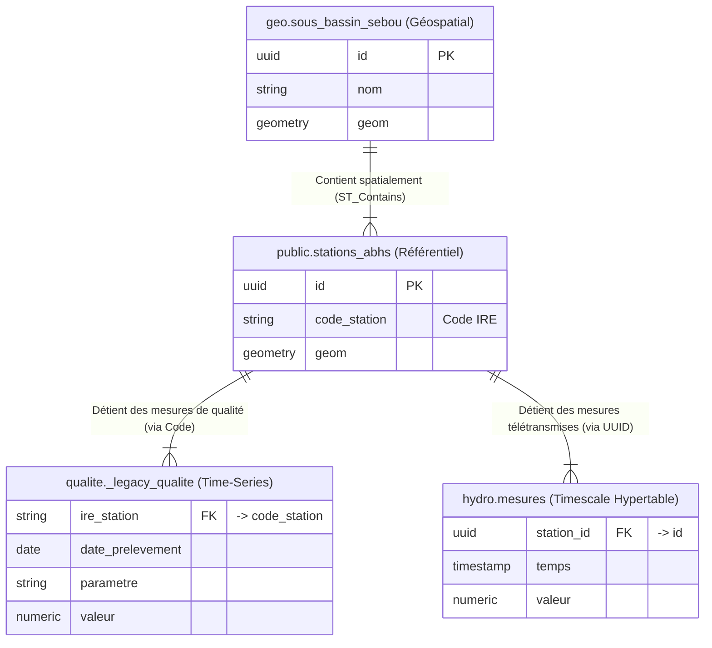

# 🏛️ Documentation & Architecture de la Base de Données `abh_sad`

> **Auteur** : Expert Data Architect / PostgreSQL  
> **Contexte** : Système d'Aide à la Décision (SAD) - Bassin du Sebou  
> **Technologies** : PostgreSQL 15+, PostGIS, TimescaleDB, pg_stat_statements

---

## 1. Résumé Exécutif

La base de données `abh_sad` est le socle de données (Data Hub) hybride du SAD de l'Agence du Bassin Hydraulique du Sebou. Elle combine des caractéristiques de **référentiel géographique (SIG)**, de **système transactionnel (OLTP)**, et surtout de **gestion de séries temporelles quantitatives et qualitatives (Time-Series / OLAP)**.

*   **Rôle Global** : Centraliser les données hydrologiques, météorologiques, la qualité des eaux, les infrastructures, et exposer ces données au travers d'une API structurée et cartographique.
*   **Empreinte Spatiale** : Forte utilisation de **PostGIS** (géométries projetées, essentiellement SRID WGS84 et Merchich).
*   **Maturité du Modèle** : Intermédiaire/Avancée. L'architecture montre une volonté claire d'urbanisation via des schémas fonctionnels (`api`, `hydro`, `qualite`), appuyée par l'extension **TimescaleDB** pour la gestion des hyper-tables de mesures chronologiques. Toutefois, une dette technique subsiste (persistance d'objets métiers critiques dans le schéma `public`).

### Volumétrie Générale Estimée
*   **Schémas détectés** : 21 (dont 7 schémas purement métiers/applicatifs).
*   **Tables (incl. chunks Timescale)** : > 2700 tables (majorité étant des partitions/chunks temporels).
*   **Vues d'exposition** : ~76 vues (fort usage dans le schéma `api`).

---

## 2. Cartographie Fonctionnelle des Schémas

La base est structurée autour de domaines métiers cloisonnés en schémas, avec l'appui massif de l'infrastructure TimescaleDB.

| Nom du Schéma | Rôle & Type de Contenu | Importance | Dépendances |
| :--- | :--- | :---: | :--- |
| **`public`** | **Schéma Historique & Référentiel mixte**. Contient à tort des tables maîtresses comme `stations_abhs` et `barrages_abhs`. | 🔴 Critique | Base pour `api` et `qualite` |
| **`api`** | **Couche d'exposition applicative (Backend/Front)**. Vues sécurisées préparant la donnée, notamment au format GeoJSON (`v_geojson_*`). | 🔴 Critique | Dépend de tous les autres |
| **`qualite`** | **Domaine Métier : Qualité des Eaux**. Référentiels des paramètres physico-chimiques, laboratoires, et mesures de prélèvements (`_legacy_qualite_riviere`). | 🟠 Majeur | Dépend de `public` (stations) |
| **`hydro`** | **Domaine Métier : Hydrologie**. Modélisation des cours d'eau, stations hydrologiques de fond, et mesures de débits jaugeages. | 🟠 Majeur | Dépend de `geo` et `public` |
| **`meteo`** | **Domaine Métier : Météorologie**. Référentiel des équipements et séries climatiques (pluviométrie). | 🟡 Moyen | Dépend de `public` |
| **`infra`** | **Infrastructures Hydrauliques**. Aménagements, STEP, décharges, barrages (dont certains historiques dans `public`). | 🟡 Moyen | Indépendant |
| **`geo`** | **Référentiels Géographiques / SIG**. Limites de bassins, sous-bassins, découpage administratif, réseaux hydrographiques. | 🟠 Majeur | Base spatiale du SAD |
| **`_timescaledb_*`** | **Moteur Time-Series**. (Internal, catalog, cache). Gère le partitionnement temporel des séries (`_hyper_55_xxx_chunk`). | ⚙️ Système | Transparent pour l'applicatif |

---

## 3. Dictionnaire Détaillé des Tables Clés (Core Business)

### 📍 Domaine : Référentiels & Infrastructures (`public` & `infra`)

#### `public.stations_abhs` (Table Maîtresse)
*   **Rôle** : Référentiel central de toutes les stations de mesure (hydro, qualité, météo).
*   **Métadonnées** : Clé Primaire (`id` de type UUID).
*   **Colonnes Clés** : 
    *   `id` (uuid, PK) : Identifiant unique universel.
    *   `code_station` (varchar) : Code métier / IRE (ex: "1217/9").
    *   `nom` (varchar) : Nom toponymique de la station.
    *   `type_station` (varchar) : Catégorisation (puits, hydrologique, source...).
    *   `altitude_m` (numeric) : Altitude en mètres.
    *   `actif` (boolean) : Statut de fonctionnement.
    *   `geom` (geometry) : Point PostGIS spatial.
*   **Analyse** : Cette table centralise géographiquement l'IoT et les prélèvements. *Défaut de conception* : Elle est restée dans le schéma `public` au lieu de migrer vers un référentiel `infra` ou `geo`.

#### `public.barrages_abhs`
*   **Rôle** : Base de données des aménagements collinaires et grands barrages.
*   **Colonnes Clés** : `id` (uuid), `nom` (varchar), `capacite_normale_mm3` (numeric), `annee_mise_service` (int), `sous_bassin_nom` (varchar, FK logique).
*   **Remarque** : *Absence actuelle de la géométrie (`geom` est NULL ou manquante)*, ce qui bloque la représentation SIG actuelle de ces ouvrages.

### 🧪 Domaine : Qualité des Eaux (`qualite`)

#### `qualite._legacy_qualite_riviere` (Hyper-table temporelle)
*   **Rôle** : Stockage transactionnel très volumineux des relevés physico-chimiques historiques (1988->Aujourd'hui).
*   **Colonnes Clés** :
    *   `ire_station` (varchar) : FK métier vers `stations_abhs.code_station`. *(Attention: jointure sur code métier plutôt que UUID)*.
    *   `date_prelevement` (date/timestamp) : Clé de partitionnement temporel.
    *   `parametre_qualite` (varchar) : Nom ou code du paramètre (NO3, DBO5, pH).
    *   `val_qual_riv` (numeric) : La mesure quantitative.
*   **Analyse** : Table structurée en modèle EAV (Entity-Attribute-Value) pivoté par paramètre.

### 💧 Domaine : Time-Series Engine (TimescaleDB)
*La base comporte des centaines de tables nommées `_timescaledb_internal._hyper_*_chunk`.*
Ces tables sont les partitions physiques d'hyper-tables (ex. mesures de débit à haute fréquence) partitionnées par intervalle de temps (généralement par mois ou semaine) et potentiellement par `station_id`. Cela permet des requêtes analytiques massives extrêmement performantes.

---

## 4. Dictionnaire Détaillé des Vues (`api`)

Le schéma `api` agit comme une **Data Access Layer (DAL)**. 

#### `api.v_geojson_*` (Collection de vues)
*   **Finalité** : Pré-formater la donnée directement au format JSON/GeoJSON pour alléger le backend FastAPI/Node.js et servir les couches Mapbox/Leaflet du Frontend.
*   **Exemples** : `api.v_geojson_stations`, `api.v_geojson_reseau_hydro`.
*   **Mécanique Probable** : Utilise les fonctions natives PostGIS `json_build_object()`, `ST_AsGeoJSON()`.

#### `api.v_station_dimension` (Obsolète/En mutation)
*   **Finalité** : Dénormaliser les informations de profil des stations (jointure avec sous-bassins, provinces, type).
*   **Problème détecté** : Les vues historiques utilisaient de vieux noms de colonnes (`id_station`, `nom_station`), rendant ces vues en erreur 500 dans la version actuelle du backend, forçant un contournement (`queries directes dans le backend FastAPI`).

---

## 5. Analyse Spatiale SIG / PostGIS

L'empreinte spatiale est omniprésente et de haute valeur métier.
*   **Types détectés** : 
    *   `POINT` : Stations, Oueds sources.
    *   `LINESTRING / MULTILINESTRING` : `geo.reseau_hydro_abhs` (Réseau hydrographique).
    *   `POLYGON / MULTIPOLYGON` : `geo.bassin_sebou`, `geo.sous_bassin_sebou`, `public.adm_regions_abhs` (Infrastructures surfaciques et administration).
*   **Coordonnées** : La plupart des géométries sont stockées en WGS84, bien que certains traitements analytiques Backend nécessitent l'utilisation de `ST_Transform(geom, 4326)` pour l'exposition web.
*   **Indexation** : Les données surfaciques lourdes (`sous_bassin_sebou`, `adm_communes_abhs`) possèdent des index `GIST` qui sont indispensables pour les requêtes `ST_Contains` (Ex : "Dans quel sous-bassin se trouve cette station hydro ?").

---

## 6. Relations et Lecture Métier du Modèle Conceptuel (MCD)

Le modèle s'articule autour de **3 piliers fonctionnels**, joints géospatialement plutôt que par des clés étrangères dures.

**Observation de modélisation :**
On observe un modèle hybride : 
1. `hydro` (Télémétrie) est "moderne", lié par un UUID propre à la station.
2. `qualite` (Historique Laboratoire) est "legacy", lié par un code métier varchar (`ire_station` = `code_station`).

---

## 7. Qualité et Cohérence des Données (Data Profiling)

D'après le récent refactoring applicatif, voici le diagnostic qualité des données vivantes :
*   **Points Forts** : 
    *   Volume conséquent conservé intègre (861 analyses qualité confirmées, remontant de 1988 à 2013).
    *   Les listes de référentiel géographique sont propres (390 stations hydrologiques catégorisées sur 15 sous-bassins).
*   **Anomalies critiques à surveiller** :
    *   **Géométrie manquante** sur les `barrages_abhs`. Le dashboard Frontend remonte "0" barrage cartographié à cause de ce manque géométrique.
    *   **Orphelins potentiels** : En cas de modification d'un `code_station` dans la table mère de `public`, il y a de forts risques de casser les liaisons avec `_legacy_qualite_riviere` (absence de contrainte ON UPDATE CASCADE sur le varchar).

---

## 8. Orientation Applicative (Usage)

La base est actuellement exploitée par une stack **FastAPI (Backend) + React/Vite (Frontend Dashboards)**.

**Flux de données :**
1.  **Backend Analytics** : Le backend effectue actuellement les jointures dures (ex : `SELECT * FROM qualite._legacy_qualite_riviere ... JOIN public.stations_abhs`). 
2.  **Moteur Vectoriel** : Les couches cartographiques Frontend s'appuient sur l'API qui convertit les objets `geom` via `ST_Transform(geom, 4326)` en GeoJSON.
3.  **Visualisation (Dashboards)** : Les tableaux de bord ("Qualité", "Hydro", "Météo") consomment les API agrégées (KPIs : nb analyses, nb dates, parametres, capacite totale barrages).

---

## 9. Analyse Critique d'Architecture

### Points Forts 🟢
1.  **Usage de TimescaleDB** : Choix technologique excellent. C'est l'état de l'art pour stocker des signaux hydro-météorologiques par millions de lignes.
2.  **Séparation par Schémas (Urbanisation)** : La réflexion de découper par `geo`, `hydro`, `qualite`, `infra` est mature.
3.  **Capacité SIG** : Intégration PostGIS au cœur des requêtes croisées.

### Points Faibles & Incohérences 🔴
1.  **Schéma `public` pollué** : Les tables cœurs (`stations_abhs`, `barrages_abhs`) sont restées dans `public`. C’est une anti-pattern PostgreSQL (le schéma `public` devrait être vide ou limité aux extensions/fonctions).
2.  **Hétérogénéité des clés (`UUID` vs `Varchar`)** : Les nouvelles tables utilisent des clés `UUID`, les anciennes (qualité d'eau) lient via le code métier (Varchar). Cela ralentit les index.
3.  **Vues de la DAL obsolètes** (`api.v_*`) : Le changement historique de schémas (nom_station -> nom) a "cassé" les anciennes vues, obligeant le backend applicatif à écrire du SQL brut, ce qui crée un couplage fort Backend-Base.

---

## 10. Recommandations Stratégiques (Roadmap)

### 📌 Court Terme (Quick Wins - S1)
*   **Correction des Géométries** : Mettre à jour la colonne `geom` de la table `barrages_abhs` pour rétablir la cartographie sur le domaine de l'hydrologie.
*   **Recompilation des Vues `api`** : Reprendre toutes les vues `api.*` (notamment `v_station_dimension`) et utiliser les nouveaux noms de colonnes : `id`, `nom`, `code_station`. Puis, nettoyer le Backend FastAPI pour qu'il ne requête **que** le schéma `api`.

### 📌 Moyen Terme (Design & Performance - M3/M6)
*   **Migration Interschéma** :
    *   Exécuter `ALTER TABLE public.stations_abhs SET SCHEMA infra;`
    *   Exécuter `ALTER TABLE public.barrages_abhs SET SCHEMA infra;`
    *   *Attention*: Nécessitera de mettre à jour le routing du backend.
*   **Indexation Hybride PostGIS** : S'assurer du recalcul de VACUUM ANALYZE sur tous les index `GIST` post-migration.

### 📌 Long Terme (Gouvernance Gouvernementale / Enterprise - Y1)
*   **Standardisation des PK/FK** : Basculer tout le système sur des `UUID`. La table `_legacy_qualite_riviere` doit être migrée sur une nouvelle hyper-table (ex: `qualite.mesure_physico_chimique`) avec `station_id (UUID)` comme FK, au lieu du code en dur.
*   **Vues Matérialisées pour les Dashboards** : Créer des `MATERIALIZED VIEW` avec un rafraîchissement journalier (via `pg_cron`) pour les calculs lourds (ex: KPIs totaux qualité/quantité), au lieu de recalculer les 800+ campagnes de mesures à chaque accès Frontend.
*   **Audit Trail** : Ajouter systématiquement les champs `created_at`, `updated_at`, et `created_by` sur toutes les tables de type référentiel (`stations`, `barrages`).
