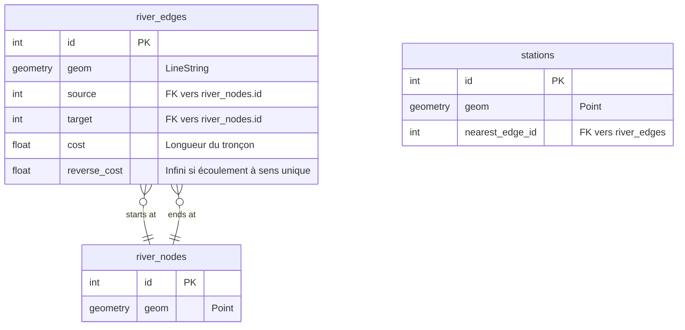

# Vision et Architecture Cible (Phase 1)

L'objectif architectural pour la Phase 1 est d'introduire la capacité de raisonner de manière "Topologique" sur le réseau.

## 1. Architecture SQL Cible
Pour rendre la couche `geo.reseau_hydrographique` routable, la structure doit évoluer vers le standard Edge/Node :

## 2. Comparaison des Algorithmes
### A. pgRouting (Recommandé)
- **Principe** : Extension de PostGIS offrant des fonctions de graphes (Dijkstra, A*).
- **Avantages** : Extrêmement rapide, exécuté 100% côté base de données, s'appuie sur la vraie topologie spatiale.
- **Inconvénients** : Nécessite une préparation rigoureuse des données (`pgr_createTopology`).

### B. Requête SQL Récursive (CTE)
- **Principe** : Utiliser un `WITH RECURSIVE` pour lier les segments (segment B commence là où segment A se termine).
- **Avantages** : Ne nécessite pas l'installation d'extensions supplémentaires en dehors de PostGIS.
- **Inconvénients** : Performance dégradée sur de grands réseaux, requêtes difficiles à maintenir.

### C. NetworkX (Python)
- **Principe** : Charger le réseau en mémoire via FastAPI et calculer le graphe avec la librairie `NetworkX`.
- **Avantages** : Flexibilité de Python, excellent pour l'analyse scientifique et temporelle (vitesses variables).
- **Inconvénients** : Surcharge mémoire du serveur, délai de latence lors du démarrage ou du rafraîchissement des données.

## 3. Stratégie MVP Évolutive (Roadmap)
- **Phase 1 : Topologie Réseau** -> pgRouting implémenté, tracé exact sur le fleuve.
- **Phase 2 : Propagation Aval** -> Identification dynamique des stations cibles.
- **Phase 3 : Temporalité** -> Introduction des vitesses d'écoulement et horaires précis (ETA).
- **Phase 4 : Modèles de Dilution** -> Ajustement par les débits, concentration.
- **Phase 5 : Aide Décisionnelle** -> Alertes et recommandations de gestion (lâchers d'eau).
