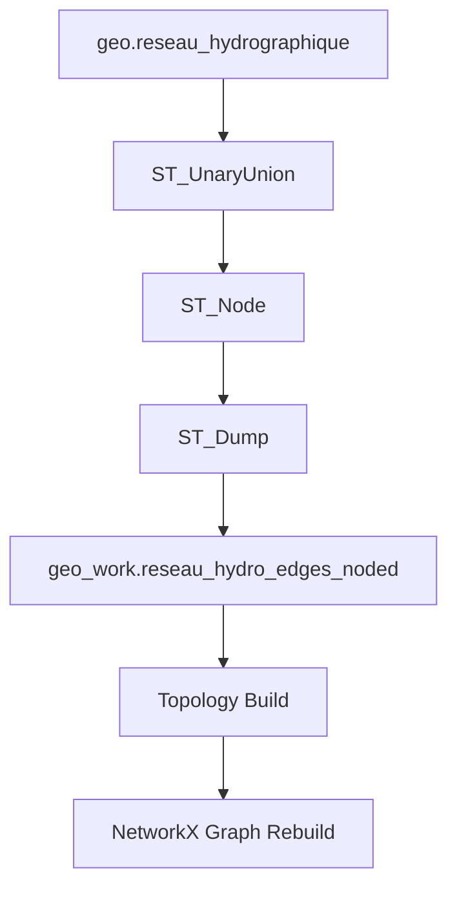

# Pipeline de Reconstruction Topologique

Le processus sera automatisé via SQL dans le schéma `geo_work`.

## Étapes Détaillées
1. **Extraction** : Sélection des géométries valides.
2. **Nodification** : `ST_Node(ST_Collect(geom))` pour créer les nœuds d'intersections.
3. **Segmentation** : `ST_Dump` pour obtenir des LineStrings unitaires.
4. **Attribution** : Jointure spatiale pour récupérer les `Z_Min`, `Z_Max` et `flow_status` des segments originaux.
5. **Nœudisation** : Création de la table `reseau_hydro_nodes_noded` par clustering (DBSCAN 0.1m).
